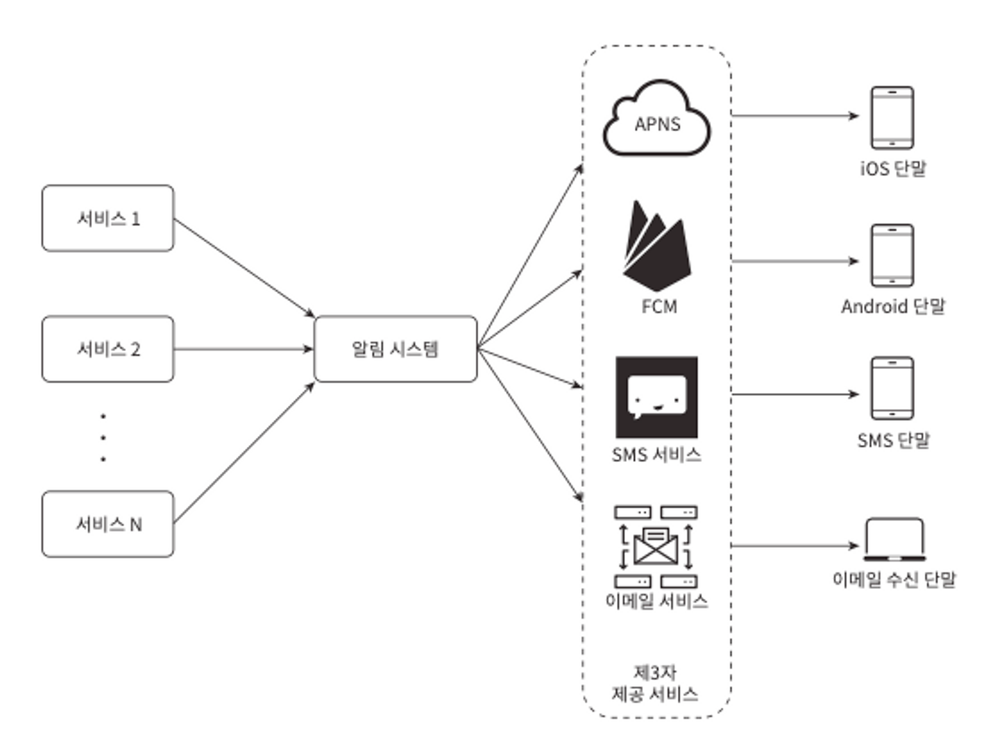

### 1단계 문제 이해 및 설계 범위 확정

질문 할 수 있는 것들

- 어떤 종류의 알림을 지원하나? (푸시 알림, SMS 메시지, 이메일 등)
- 실시간 시스템이어야 하나? (연성 실시간 soft real-time)
- 어떤 종류의 단말을 지원해야 하나? (iOS 단말, android 단말, 랩톱/데스트톱 등)
- 알림을 받지 않도록 설정할 수 있어야 하나?
- 몇 건의 알림을 보낼 수 있어야 하나?

### 2단계 개략적 설계안 제시 및 동의 구하기

**알림 유형별 지원 방안**

- iOS 푸시 알림

  

    - 알림 제공자(provider): 알림 요청(notification request)을 만들어 애플 푸시 알림 서비스(APNS: Apple Push Notification Service)로 보내는 주체. 요청을 만드려면 다음과 같은 데이터가 필요.
        - 단말 토큰(device token): 알림 요청을 보내는 데 필요한 고유 실별자.
        - 페이로드(payload): 알림 내용을 담은 JSON 딕셔너리.

            ```json
            {
            	"apps": {
            		"alert": {
            			"title": "Game Request",
            			"body": "Bob wants to lay chess",
            			"action-loc-key": "PLAY"
            		},
            		"badge": 5
            	}
            }
            ```

    - APNS: 애플이 제공하는 원격 서비스. 푸시 알림을 iOS 장치로 보내는 역할을 담당.
    - iOS device: 푸시 알림을 수신하는 사용자 단말.
- 안드로이드 푸시 알림

  

    - 애플과 비슷한 절차로 전송. APNS 대신 FCM(Firebase Cloud Messaging)을 사용한다는 점만 다름.
- SMS 메시지
    - 보통 제 3 사업자읫 서비스를 많이 이용… (트윌리오, 넥스모?)
- 이메일
    - 대부분의 회사는 고유 이메일 서버를 구축할 역량을 갖추고 있지만… 많은 회사가 상용 이메일 서비스를 이용… (센드그리드, 메일침프…? 전송 성공률도 높고, 데이터 분석 서비스도 제공함…)

**연락처 정보 수집 절차**

사용자가 우리 앱을 설치하거나 처음으로 계정을 등록하면 API 서버는 해당 사용자의 정보를 수집하여 데이터베이스에 저장.


**알림 전송 및 수신 절차**

- 계략적 설계안 (초안)
    - 1부터 N까지의 서비스: 이 서비스는 각각의 마이크로서비스, 크론잡, 분산 시스템 컴포넌트일 수도 있음.
    - 알림 시스템: 1개의 서버만 사용하는 시스템이라고 가정. 서비스 1~N에 알림 전송을 위한 API를 제공해야 하고, 제 3자 서비스에 전달할 알림 페이로드를 만들어 낼 수 있어야 함.
    - 제3자 서비스: 유의해야할 점은 확장성임.

      

    - iOS, 안드로이드, SMS, 이메일 단말: 사용자는 자기 단말이에서 알림을 수신.
- 초안에 대한 문제점
    - SPOF
    - 규모 확장성: 한 대 서비스로 푸시 알림에 관계된 모든 것을 처리하므로, 디비나 캐시 등 중요 컴포넌트의 규모를 개별적으로 늘릴 방법이 없음.
    - 성능 병목: SPOF에서 파생되는 문제점… (시간이 많이 걸린다든가… 과부하 상태에 빠진다든가… 등)
- 개략적 설계안 (개선된 버전)
    - 데이터베이스와 캐시를 알림 시스템의 주 서버에서 분리
    - 알림 서버를 증설, 자동으로 수평적 규모 확장이 이루어질 수 있도록 함. (쿠버네티스… 결국 클라우드 서비스를 사용…? 해야함?)
    - 메시지 큐를 이용해 시스템 컴포넌트 사이의 강한 결합을 끊음.

  

    - 알림 서버의 기능
        - 알림 전송 API
        - 알림 검증
        - 데이터베이스 또는 캐시 질의
        - 알림 전송
    - 캐시: 사용자 정보, 단말 정보, 알림 템플릿 등을 캐시
    - 데이터베이스: 사용자, 알림, 설정 등 다양한 정보를 저장
    - 메시지 큐: 시스템 컴포넌트 간 의존성을 제거하기 위해 사용. 다랼ㅇ의 알림이 전송되어야 하는 경우를 대비한 버퍼 역할도함.
    - 작업 서버: 메시지 큐에서 전송할 알림을 꺼내서 제3자 서비스로 전달하는 역할을 담당.
- 협력에 대한 순서
    1. API를 호출하여 알림 서버로 알림을 보냄
    2. 알림 서버는 사용자 정보, 단말 토큰, 알림 설정 같은 메타데이터를 캐시나 데이터베이스에서 가져옴
    3. 알림 서버는 전송할 알림에 맞는 이벤트를 만들어서 해당 이벤트를 위한 큐에 넣음.
    4. 작업 서버는 메시지 큐에서 알림 이벤트를 꺼냄.
    5. 작업 서버는 알림을 제3자 서비스로 보냄.
    6. 제3자 서비스는 사용자 단말로 알림을 전송


### 3단계 상세 설계

**안정성**

안정성을 확보하기 위한 사항 몇 가지들

1. 데이터 손실 방지
    - 알림 전송 시스템의 가장 중요한 요구사항 가운데 하나는 어떤 상황에서도 알림이 소실되면 안된다는 것.
    - 이 요구사항을 만족하려면 알림 시스템은 알림 데이터를 데이터베이스에 보관하고 재시도 메커니즘을 구현해야함.
2. 알림 중복 전송 방지
    - 중복을 탐지하는 메커니즘을 도입하고, 오류를 신중하게 처리해야함.
    - 보내야 할 일림이 도착하면 그 이벤트 ID를 검사하여 이전에 본 적이 있는 이벤트인지 살핀다.

**추가로 필요한 컴포넌트 및 고려사항**

- 알림 템플릿
    - 알림 템플릿은 인자나 스타일, 추적 링크를 조정하기만 하면 사전에 지정한 형식에 맞춰 알람을 만들어 내는 틀.
    - ex) 지금 [item_name]을 주문 또는 예약하세요!
- 알림 설정
    - 알림 설정을 도입했으면 알림을 보내기 전에 반드시 해당 사용자가 해당 알림을 켜 두었는지 확인해야함.
- 전송률 제한
    - 그냥 사용자가 꺼버리니까 … 그냥 운영상? 제한하는거
- 재시도 방법
    - 재시도 전용 큐를 만들어두면 됨. 같은 문제가 계속해서 발생하면 개발자에게 통지하는 방식으로.
- 푸시 알림과 보안
    - iOS와 안드로디으 앱의 경우, 알림 전송 API는 appKey와 appSecret을 사용하여 보안을 유지.
- 큐 모니터링
    - 알림 시스템을 모니터링 할 때 중요한 메트릭 하나는 큐에 쌓인 알림의 개수임.
    - 이 수가 너무 크면 작업 서버들이 이벤트를 빠르게 처리하고 있지 못하다는 뜻. → 증설하는게 바람짓
- 이벤트 추적
    - 보통 알림 시스템을 만들면 데이터 분석 서비스와도 통합해야만 함.

**수정된 설계안**


- 알림 서버에 인증과 전송률 제한 기능이 추가
- 전송 실패에 대응하기 위한 재시도 기능이 추가
- 전송 템플릿을 사용하여 알림 생성 과정을 단순화하고 알림 내용의 일관성을 유지
- 모니터링과 추적 시스템을 추가하여 시스템 상태를 확인하고 추후 시스템을 개선하기 쉽도록하였음.

### 4단계 마무리

여기서 집중해서 배운 것들

- 안정성
- 보안
- 이벤트 추적 및 모니터링
- 사용자 설정
- 전송률 제한
