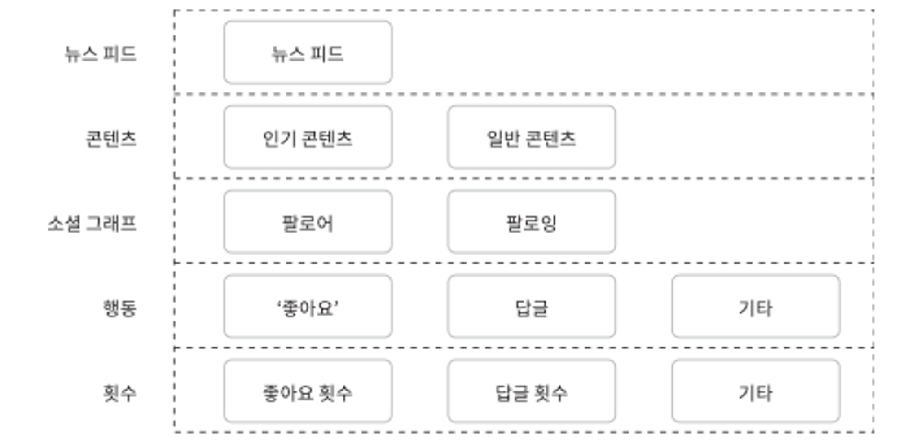

### 1단계 문제 이해 및 설계 범위 확정

뉴스 피드 시스템 설계에서 질문할 수 있는 것들

- 모바일 or 웹? 아니면 모바일 and 웹?
- 중요 기능?
- 피드에 어떤 순서로 스토리가 표시? 토픽 점수같은 기준이 있는가? (가까운 친구의 포스트는 좀 더 위에 배치 등)
- 최대 몇 명의 친구를 가질 수 있나?
- 트래픽 규모?
- 피드에 이미지나 비디오 스토리도 올라갈 수 있나?

### 2단계 개략적 설계안 제시 및 동의 구하기

> 지금부터 살펴볼 설계안은 두 가지 부분으로 나뉨
>
> - 피드 발행: 사용자가 포스팅하면 해당 데이터를 캐시와 디비에 기록. 새 포스팅은 친구의 뉴스 피드에도 전송
> - 뉴스 피드 생성: 지면 관계상 뉴스 피드는 모든 친구의 포스팅을 시간 흐름 역순으로 모아서 만든다고 가정

**뉴스 피드 API**

- 뉴스 피드 API는 클라이 언트가 서버와 통신하기 위해 사용하는 수단
- HTTP 프로토콜 기반이고, 상태 정보 업데이트, 뉴스 피드 가져오그, 친구를 추가하는 등의 다양한 작업을 수행하는데 사용
- 가장 중요한 API는 피드 발행 API와 피드 읽기 API.

**피드 발행**

- 사용자: 웹앱에서 새 포스팅을 올리는 주체 피드 발행 API 사용.
- 로드밸런서: 트래픽을 웹 서버들로 분산
- 웹 서버: HTTP 요청을 내부 서비스로 중계하는 역할을 담당
- 포스팅 저장 서비스: 새 포스팅을 데이터베이스와 캐시에 저장
- 포스팅 전송 서비스: 새 포스팅을 친구의 뉴스 피드에 푸시. 뉴스 피드 데이터는 캐시에 보관.
- 알림 서비스: 친구들에게 새 포스팅이 올라왔음을 알리거나, 푸시 알림을 보내는 역할 담당

**뉴스 피드 생성**

- 사용자: 뉴스 피드를 읽는 주체. 피드 읽기 API 사용.
- 뉴스 피드 캐시: 뉴스 피드를 렌더링할 때 필요한 필드 ID를 보관.

### 3단계 상세 설계

**피드 발행 흐름 상세 설계**

- 웹 서버
    - 웹 서버는 클라이언트와 통신할 뿐 아니라 인증이나 처리율 제한 등의 기능도 수행.
    - 올바른 인증을 처리.
- 포스팅 전송(팬아웃) 서비스
    - 포스팅 전송, 즉 팬아웃(fanout)은 어떤 사용자의 새 포스팅을 그 사용자와 친구 관계에 있는 모든 사용자에게 전달하는 과정.
    - 팬아웃에는 두 가지 모델이 있음.
        1. 쓰기 시점에 팬아웃(fanout-on-write, 푸시 모델이라고도 함)
            - 새로운 포스팅을 기록하는 시점에 뉴스 피드를 갱신.
              → 포스팅이 완료되면 바로 해당 사용자의 캐시에 해당 포스팅 기록
            - 장점
                - 피드가 실시간으로 갱신되며 친구 목록에 있는 사용자에게 즉시 전송.
                - 새 포스팅이 기록되는 순간 뉴스 피드가 이미 갱신되므로(pre-computed) 뉴스 피드를 읽는 데 드는 시간이 짧아짐
            - 단점
                - 친구가 많은 사용자의 경우 친구 목록을 가져오고 그 목록에 있는 사용자 모두의 뉴스 피드를 갱신하는 데 많은 시간이 소요될 수 있음. 핫키(hotkey)라고 부르는 문제임.
                - 서비스를 자주 이용하지 않는 사용자의 피드까지 갱신 → 자원 낭비…
                  *(토픽 점수가 될 수도 있겠다.!)*
        2. 읽기 시점에 팬아웃(fanout-on-read, 풀 모델이라고도 함)
            - 피드를 읽어야 하는 시점에 뉴스 피드를 갱신. 요청 기반(on-demand) 모델.
              → 사용자가 본인 홈페이지나 타임 라인을 로딩하는 시점에 새로운 포스트를 가져옴.
            - 장점
                - 비활성화된 사용자, 또는 서비스에 거의 로그인하지 않는 사용자의 경우 유리 → 자원 낭비 X
                - 핫키 문제 X
            - 단점
                - 뉴스 피드를 읽는 데 많은 시간이 소요될 수 있음.

→ 요구 사항에 맞는 팬아웃은? 나라면…

피드에 노출되는 게시물이 친구의 게시물만 노출이되는가?에 대한 질문을 추가적으로 할 수 있을것 같고…
만약 친구의 게시물만 노출되는게 아니라면 친구의 게시물은 푸시 모델을, 다른 추천 게시물은 풀 모델을 사용할 것 같다…

또 서비스를 자주 이용하지 않는 사용자에 대한 토픽 점수를 부여해서 푸시 모델의 단점(자원 낭비)을 줄일 수 있을 것…!

> 본 설계안의 경우에는 이 두가지 방법을 결합하여 장점은 취하고 단점은 버리는 전략을 취할것.
친구나 팔로워를 기준으로, 대부분의 사용자는 푸시 모델을 사용하고 아주 많은 경우에는 풀 모델을 사용.
또한 안정 해시를 통해 요청과 데이터를 보다 고르게 분산하여 핫키 문제를 줄여볼 것.
>

1. 그래프 디미에서 친구 ID 목록을 가져옴. ([그래프 데이터베이스](https://www.usenix.org/system/files/conference/atc13/atc13-bronson.pdf)는 친구 관계나 친구 추천을 관리하기 적합)
2. 사용자 정보 캐시에서 친구들의 정보를 가져옴. 사용자 설정에 따라 친구 가운데 일부를 걸러내야함 → 피드 업데이트를 무시하기로 설정했다면 보이지 않아야함.
3. 친구 목록과 새 스토리의 포스팅 ID를 메시지 큐에 넣음.
4. 풀 모델 작업 서버가 메시지 큐에서 데이터를 꺼내어 뉴스 피드 데이터를 뉴스 피드 캐시에 넣음. 뉴스 피드 캐시는 <포스팅ID, 사용자ID>의 순서쌍을 보관하는 매핑 테이블이라 볼 수 있음. 사용자 정보와 포스팅 정보 전부를 이 테이블에 저장하지 않는 이유는, 메모리 요구량이 지나치게 늘어날 수 있기 때문. 메모리 크기를 적정 수준으로 유지하기 위해서, 이 캐시 크기에 제한을 두며, 해당 값은 조정이 가능하도록 함.

**피드 읽기 흐름 상세 설계**

사진만 봐도 뭔지 알겠지?

**캐시 구조**

캐시는 뉴스 피드 시스템의 핵심 컴포넌트. 본 설계안의 경우에는 그럼과 같이 캐시를 다섯 계층으로 나눔.

- 뉴스 피드: 뉴스 피드의 ID 보관
- 콘텐츠: 포스팅 데이터를 보관, 인기 콘텐츠는 따로 보관.
- 소셜 그래프: 사용자 간 관계 정보를 보관.
- 행동(action): 포스팅에 대한 사용자의 행위에 관한 정보 저장. (좋아요, 공유 등)
- 횟수(counter): 좋아요 횟수, 응답 수 등을 보관

### 4단계 마무리

다루면 좋을 만한 주제

- 데이터 베이스 규모 확장
    - 수직적 규모 확장 vs 수평적 규모 확장
    - SQL vs NoSQL
    - master-slave 다중화
    - 복제본(replica)에 대한 읽기 연산
    - 일관성 모델
    - 샤딩
- 웹 계층을 무상태로 운영
- 가능한 한 많은 데이터를 캐시할 방법
- 여러 데이터 센터를 지원할 방법
- 메시지 큐를 사용하여 컴포넌트 사이의 결합도 낮추기
- 핵심 메트릭에 대한 모니터링. (트래픽이 몰리는 시간대의 QPS, 새로고침 지연 시간 등)
