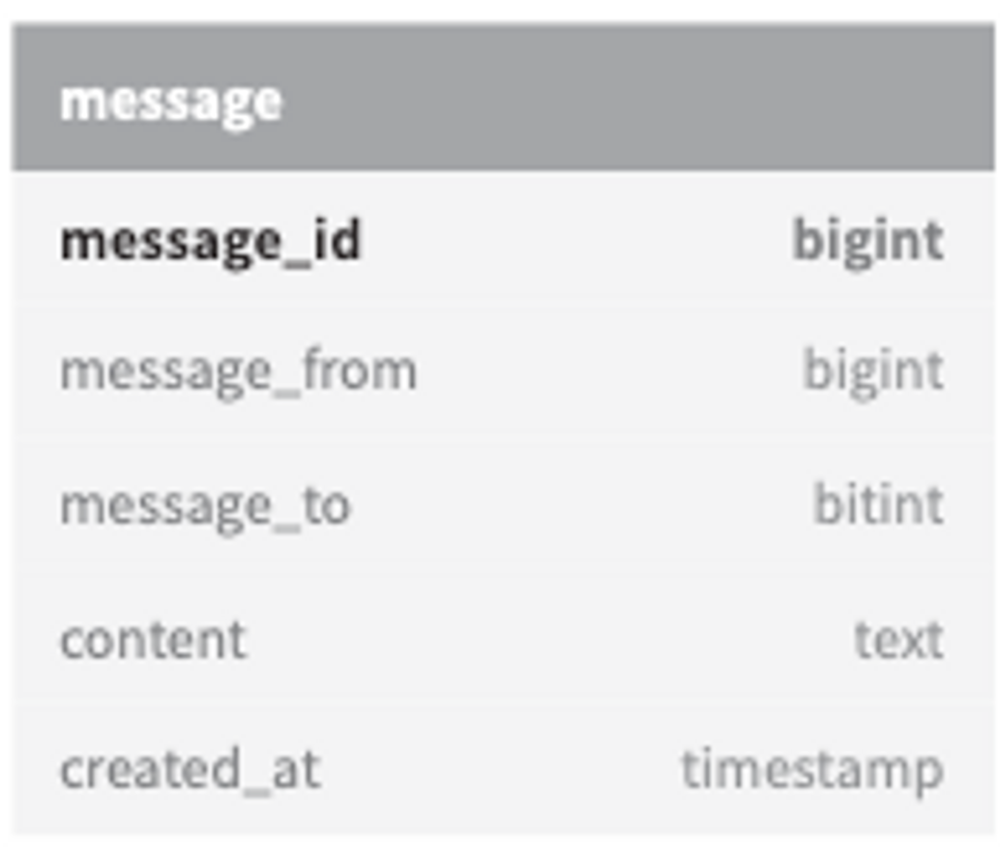

### 1단계 문제 이해 및 설계 범위 확정

물어볼 수 있는 질문들

- 어떤 앱인가? 1:1 채팅 앱인가? 그룹 채팅 앱인가?
- 모바일 앱인가? 웹앱인가?
- 트래픽의 규모는?
- 그룹 채팅의 경우 인원 제한이 있는가?
- 중요 기능으로 어떤 것이 있나? (첨부 파일 등)
- 메시지 길이에 제한이 있나?
- 종단 간 암호화(end-to-end encryption)를 지원해야하나?
- 이력 보관의 기간은?
- 어떤 프로토콜을 사용하는가?

우리가 설계할 것 (페이스북 메신저와 유사한 채팅 앱)

- 응답지연이 낮은 일대일 채팅 기능
- 최대 100명까지 참여할 수 있는 그룹 채팅 기능
- 사용자의 접속상태 표시 기능
- 다양한 단말 지원. 하나의 계정으로 여러 단말에 동시 접속 지원
- 푸시 알림

### 2단계 개략적 설계안 제시 및 동의 구하기

채팅 서비스는 아래 기능을 제공할 것

- 클라이언트들로부터 메시지 수신
- 메시지 수신자(recipient) 결정 및 전달
- 수신자가 접속(online) 상태가 아닌 경우에는 접속할 때가지 해당 메시지 보관

**폴링**

폴링이란 클라이언트가 주기적으로 서버에게 새 메시지가 있느냐고 물어보는 방법

- 단점 : 폴링 비용은 폴링을 자주하면 할수록 올라가기 때문에 답해줄 메시지가 없는 경우에 서버 자원이 불필요하게 낭비됨.

**롱 폴링**

롱 폴링은 클라이언트가 새 메시지가 반환되거나 타임아웃 될 때까지 연결을 유지.
클라이언트는 새 메시지를 받으면 기존 연결을 종료하고 서버에 새로운 요청을 보내어 모든 절차를 다시 시작.

- 단점
    - 메시지를 보내는 클라이언트와 수신하는 클라이언트가 같은 채팅 서버에 접속하게 되지 않을 수 있음.
      HTTP 서버들은 보통 무상태(stateless) 서버라 로드밸런싱을 위해 라운드 로빈 알고리즘을 사용하는데 메시지를 받은 서버는 해당 메시지를 수신할 클라이언트와의 롱 폴링 연결을 가지고 있지 않은 서버일 수 있음.
    - 서버 입장에서는 클라이언트가 연결을 해제했는지 아닌지 알 좋은 방법이 없음.
    - 여-전히 비효율적. 메시지를 많이 받지 않는 클라이언트도 타임아웃이 일어날 때 마다 주기적으로 서버에 다시 접속할 것.

**웹소켓**

웹소켓(WebSocket)은 서버가 클라이언트에게 비동기(async) 메시지를 보낼 때 가장 널리 사용하는 기술.

- 웹소켓 연결은 클라이언트가 시작함.
- 한번 맺어진 연결은 항구적이며 양방향. 이 연결은 처음에는 HTTP 연결이지만 특정 핸드셰이크 절차를 거쳐 웹소켓 연결로 업그레이드.
- 웹소켓은 일반적으로 방화벽이 있는 환경에서도 잘 동작. 80, 443 포트 번호를 그대로 쓰기 때문.

**개략적 설계안**

- 무상태 서비스
    - 로그인, 회원가입, 사용자 프로파일 표시 등을 처리하는 전통적인 요청/응답 서비스.
    - 로드벨런서 뒤에 위치.
    - 이 서비스들은 모놀리틱 서비스일 수도 있고 마이크로서비스일 수도 있음.
    - 좀 더 자세히 살펴볼 것은 ‘서비스 탐색(service discovery)’ 서비스. 이 서비스는 클라이언트가 접속할 채팅 서버의 DNS 호스트명을 클라이언트에게 알려주는 역할을 함.
- 상태 유지 서비스
    - 각 클라이언트가 채팅 서버와 독립적인 네트워크 연결을 유지해야 하기 때문에 유일하게 상태 유지가 필요한 서비스는 채팅 서비스.
    - 앞서 간단히 설명한 서비스 탐색 서비스는 채팅 서비스와 긴밀히 협력하여 특정 서버에 부하가 몰리지 않도록함.!
- 제3자 서비스 연동
    - 제3자 서비스는 푸시 알림. 새 메시지를 받았다면 설사 앱이 실행 중이지 않더라도 알림을 받아야함.
- 규모 확장성
    - 누구도 큰 규모의 트래픽을 서버 한 대로 처리하려 하지 않을 것. (SPOF 등)

- 채팅 서버는 클라이언트 사이에 메시지를 중계하는 역할을 담당
- 접속 상태 서버(presence server)는 사용자의 접속 여부를 관리
- API 서버는 로그인, 회원가입, 프로파일 변경 등 그 외 나머지 전부를 처리.
- 알림 서버는 푸시 알림을 보냄.
- 키-값 저장소(key-value store)에는 채팅 이력을 보관.

- 저장소
    - 데이터 계층을 올바르게 만드는 데는 노력이 필요. 중요한 것 하나는 어떤 데이터베이스를 쓰느냐다. 관계형 데이터베이스? NoSQL?… 이 질문에 대한 올바른 답을 하기 위해 중요하게 따져야 할 것은, 데이터의 유형과 읽기/쓰기 연산의 패턴. 어떤 것을 고려해야할까?
        - 채팅 이력 데이터의 양은 엄청남.
        - 이 데이터 가운데 빈번하게 사용되는 것은 주로 최근에 주고받은 메시지. 데부분의 사용자는 오래된 메시지는 들여다보지 않음.
        - 대체로 최근에 주고받은 메시지 데이터만 보게 되는 것이 사실이나, 검색 기능을 이요하거나, 특정 사용자가 언급된 메시지를 보거나, 특정 메시지로 점프하거나 하여 무작위적인 데이터 접근을 하게 되는 일도 있음.
          → 이런 기능도 지원해야한다는 말
        - 1:1 채팅 앱의 경우 읽기:쓰기 비율은 대략 1:1정도.
    - 이 모두를 지원할 데이터베이스를 고르는 것은 아주 중요한 일.
    - 본 설계안의 경우에는 키-값 저장소를 추천. 왜냐?
        - 키-값 저장소는 수평적 규모확장이 쉬움.
        - 키-값 저장소는 데이터 접근 지연시간이 낮음.
        - 관계형 데이터베이스는 데이터 가운데 롱 테일에 해당하는 부분을 잘 처리하지 못하는 경향이 있음.
          → ???? 우린 롱 테일 설계가 아닌데요? 걍 끼워 맞추려고…
        - 이미 많은 안정적인 채팅 시스템이 키-값 저장소를 채택.
        - (갠적으로는 이유가 조금.. 타당하지 않다고 생각이 드네요…)

**데이터 모델**

- 1:1 채팅을 위한 메시지 테이블
    - message_id - 메시지 순서를 쉽게 정할 수 있도록 하는 역할 담당
    - created_at - 이 컬럼으로 메시지 순서로 정할 수 있음. 동시에 만들어질 수 있기 때문

- 그룹 채팅을 위한 메시지 테이블
    - (channel_id, message_id)의 복합키(composite key)를 기본 키로 사용.
    - channel_id는 파티션 키로도 사용할 것인데, 그룹 채팅에 적용될 모든 질의는 특정 채널을 대상으로 할 것이기 때문.

- 메시지 ID
    - message_id를 만든느 기법은 자세히 논의할 만한 가치가 있는 흥미로운 주제. 다음과 같은 속성을 만족해야할 것.
        - message_id의 값은 고유해야함.
        - ID 값은 정렬 가능해야 하며 시간 순서와 일치해야함.
    - 방법 하나는 스노플레이크 같은 전역적 64-bit 순서 번호 생성기를 이용.
    - 마지막 방법은 지역적 순서 번호 생성기를 이용.
      → 지역적이라 함은, ID의 유일성은 같은 그룹 안에서만 보증하면 충분하다는 것.
    - (개인프로젝트에서는 streamKey라는 것이 채널 느낌이었어서 지역적 순서 번호 생성기 느낌으로 난수 생성을 햇음.)

### 3단계 상세 설계

**서비스 탐색**

- 서비스 탐색 기능의 주된 역할은 클라이언트에게 가장 적합한 채팅 서버를 추천하는 것.
- 이때 사용되는 기준으로는 클라이언트의 위치, 서버의 용량 등이 있음.
- 서비스 탬색 기능을 구현하는 데 널리 쓰이는 오픈 소스 솔루션은 [아파치 주키퍼](https://engkimbs.tistory.com/660) 같은 것이 있다.

1. 사용자 A가 시스템에 로그인을 시도한다
2. 로드밸런서가 로그인 요청을 API 서버들 가운데 하나로 보낸다
3. API 서버가 사용자 인증을 처리하고 나면 서비스 탐색 기능이 동작하여 해당 사용자를 서비스할 최적의 채팅 서버를 찾는다.
4. 사용자 A는 채팅 서버 2와 웹소켓 연결을 맺는다.

**메시지 흐름**

- 1:1 채팅 메시지 처리 흐름

  

    1. 사용자 A가 채팅 서버 1로 메시지 전송
    2. 채팅 서버 1은 ID 생성기를 사용해 해당 메시지의 ID 결정
    3. 채팅 서버 1은 해당 메시지를 메시지 동기화 큐로 전송
    4. 메시지가 키-값 저장소에 보관됨
    5. (a) 사용자 B가 접속 중인 경우 메시지는 사용자 B가 접속 중인 채팅 서버로 전송. 사용자 B가 접속 중이 아니라면 푸시 알림 메시지를 푸시 알림 서버로 보냄.
    6. 채팅 서버 2는 메시지를 사용자 B에게 전송. 사용자 B와 채팅 서버 2 사이에는 웹 소켓이 연결되어 있는 상태이므로 그것을 이용
- 여러 단말 사이의 메시지 동기화
    - 음? 이건 뭔 소린지 모르겠어요
- 소규모 그룹 채팅에서의 메시지 흐름
    - 음?? 이것도 뭔 소린지 모르겠어요

**접속상태 표시**

채팅 애플리케이션을 사용하다 보면 사용자의 프로파일 이미지나 대화명 옆에 녹색 점이 붙어 있는 것을 보게 되는데, 이것이 바로 사용자가 접속중임을 나타냄. 이걸 표현하기 위해서 무엇이 필요할까?

- 사용자 로그인
    - 사용자 로그인 절차에 대해서는 “서비스 탐색” 절에서 설명한 바 있음.
    - 클라이언트와 실시간 서비스 사이에 웹소켓 연결이 맺어지고 나면 접속상태 서버는 A의 상태와 last_active_at 타임스탬프 값을 카-값 저장소에 보관.
- 로그아웃
    - 로그아웃을 하면 키-값 저장소에 보관된 사용자 상태가 online에서 offline으로 바뀌게 된다.
    - → 로그아웃하는 시점에 API를 통해 키-값 저장소에 상태를 바꿔줌.
- 접속 장애

  

    - 사용자의 인터넷 연결이 끊어지면 클아이언트와 서버 사이에 맺어진 웹소켓 같은 서버도 끊길것.
    - 이런 장애에 대응하는 간단한 방법은 사용자를 오프라인 상태로 표시하고 연결이 복구되면 온라인 상태로 변경하는 것. → 하지만 연결이 끊어지는 것은 흔함. 지나친 일이 되어버림.
    - 본 설계안은 박동 검사를 통해 이 문제를 해결.
    - 온라인 상태의 클라이언트로 하여금 주기적으로 박동 이벤트를 접속상태 서버로 보내도록 하고, 마지막 이벤트를 받은 지 x초 이내에 또 다른 박동 이벤트 메시지를 받으면 해당 사용자의 접속 상태를 계속 온라인으로 유지.
- 상태 정보의 전송

  

    - 그룹 하나에 100,000 사용자가 있다고 하자. 그러면 상태변화 1건당 100,000개의 이벤트 메시지가 발생할 것.
    - 이런 성능 문제를 해소하는 한 가지 방법은 사용자가 그룹 채팅에 입장하는 순간에만 상태 정보를 읽어가게 하거나, 친구 리스트에 있는 사용자의 접속 상태를 갱신하고 싶으면 수동으로 하도록 유도하는것.

### 4단계 마무리

추가 논의할 수 있는 내용

- 채팅 앱을 확장하여 사진이나 비디오 등의 미디어를 지원하도록 하는 방법
    - 압축 방식, 클라우드 저장소, 썸네일 생성 등을 논의해보면 재밌을 것.
- 종단 간 암호화
    - 메시지 발신인과 수신자 이외에는 아무도 메시지 내용을 볼 수 없다는 뜻.
- 캐시
- 로딩 속도 개선
    - 슬랙은 사용자의 데이터, 채널 등을 지역적으로 분산하는 네트워크를 구축하여 앱 로딩 속도를 개선
- 오류 처리
    - 채팅 서버 오류: SPOF로 서버가 죽어버리면 서비스 탐색 기능이 동작하여 클라이언트에게 새로운 서버를 배정하고 다시 접속할 수 있도록 해야함.
    - 메시지 재전송: 재시도(retry)나 큐(queue)는 메시지의 안정적 전송을 보장하기 위해 흔히 사용되는 기법
