## 1단계 문제 이해 및 설계 범위 확정

질문할 수 있는 것들

- 사용자가 입력하는 단어는 자동완성될 검색어의 첫 부분이어야 하나? 아니면 중간 부분이 될수도 있나?
- 몇 개의 자동완성 검색어가 표시되어야 하나?
- 자동완성 검색어 5개를 고르는 기준은 무엇인가?
- 맞춤법 검사 기능도 제공해야 하나?
- 질의는 영어인가?
- 대문자나 특수 문자 처리도 해야하나?
- 얼마나 많은 사용자를 지원해야하나?

### 요구 사항

- 빠른 응답 속도
- 연관성: 자동완성되어 출력되는 검색어는 사용자가 입력한 단어와 연관된 것이어야 함.
- 정렬: 시스템의 계산 결과는 인기도 등의 순위 모델(ranking model)에 의해 정렬되어 있어야 함.
- 규모 확장성
- 고가용성

### 개략적 규모 추정

- 일간 능동 사용자(DAU)는 천만 명으로 가정
- 한 사용자는 매일 10건의 검색을 수행
- 질의할 때마다 평균적으로 20바이트의 데이터를 입력한다고 가정
- 검색창에 글자를 입력할 때마다 클라이언트는 검색어 자동완성 백엔드에 요청을 보냄. 따라서 평균적으로 1회 검색당 20건의 요청이 백엔드로 전달.
    - search?q=d
    - search?q=di
    - search?q=din
    - search?q=dinn
- 대략 초당 24,000의 질의(QPS) 발생 (=10,000,000 사용자 * 10질의 / 일자 * 20자 / 24시간 / 3600초)
- 최대 QPS = QPS X 2 = 대략 48,000
- 질의 가운데 20% 정도는 신규 검색어라고 가정. 따라서 대락 0.4GB 정도(=10,000,000사용자 * 10 질의 / 일 * 20자 * 20%)

## 2단계 개략적 설계안 제시 및 동의 구하기

개략적으로 보면 시스템은 두 부분으로 나뉨

- 데이터 수집 서비스(data gathering service): 사용자가 입력한 질의를 실시간으로 수집하는 시스템. 데이터가 많은 애플리케이션에 실시간 시스템은 그다지 바람직하지 않지만 설계안을 만드는 출발점으로는 괜찮을 것.
- 질의 서비스(query service): 주어진 질의에 다섯 개의 인기 검색어를 정렬해 내놓은 서비스

### 데이터 수집 서비스

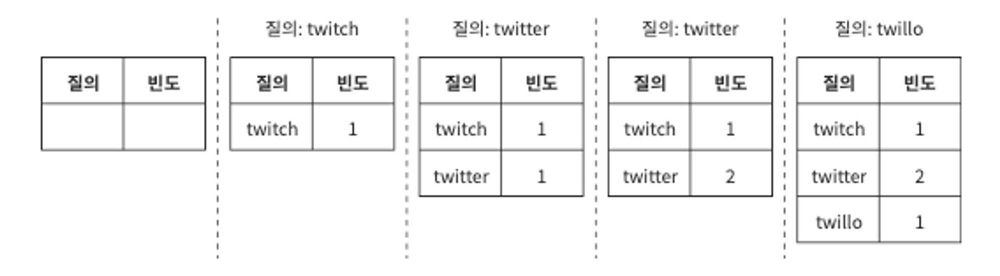

### 질의 서비스

- query: 질의문을 저장하는 필드
- requency: 질의문이 사용된 빈도를 저장하는 필드

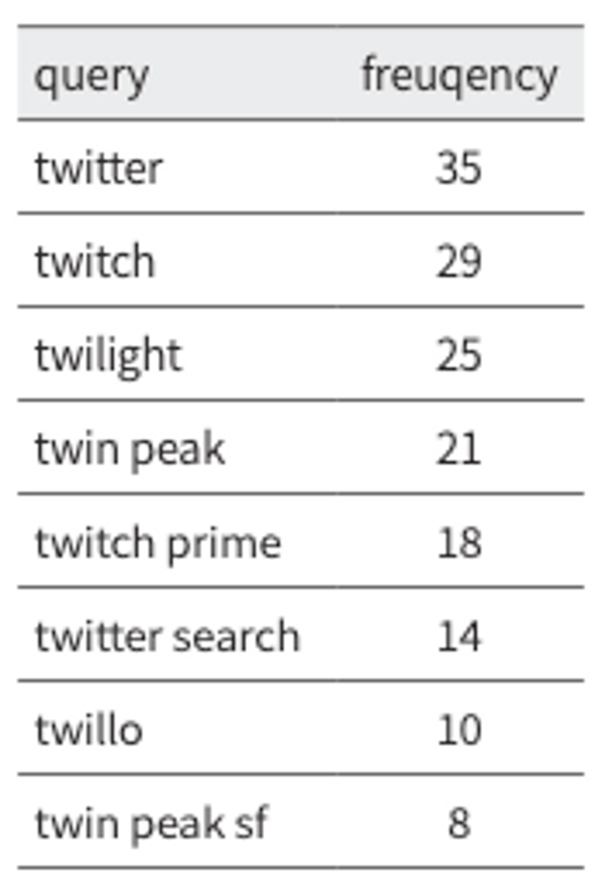

위 상태에서 “tw”를 검색할 때 표시되어야하는 것

- twitter
- twitch
- twilight
- twin peak
- twitch prime

```sql
SELECT * FROM frequency_table 
WHERE query Like `prefix%` 
ORDER BY frequency 
DESC
LIMIT 5
```

데이터 양이 적을 때는 나쁘지 않은 설계안. 하지만 데이터가 아주 많아지면 데이터베이스가 병목이 될 수 있음.

## 3단계 상세 설계

이번 절에서는 컴포넌트를 몇 개 골라 보다 상세히 설계하고 최적화 방안을 논의할 것.

### 트라이 자료구조

트라이는 문자열들을 간략하게 저장할 수 있는 자료구조

[[자료구조] 트라이 (Trie)](https://velog.io/@kimdukbae/자료구조-트라이-Trie)

- 트라이는 트리 형태의 자료구조.
- 이 트리의 루트 노드는 빈 문자열을 나타냄
- 각 노드는 글자(character) 하나를 저장하며, 26개의 자식 노드를 가질 수 있음.
- 각 트리 노드는 하나의 단어, 또는 접두어 문자열(prefix string)을 나타냄.

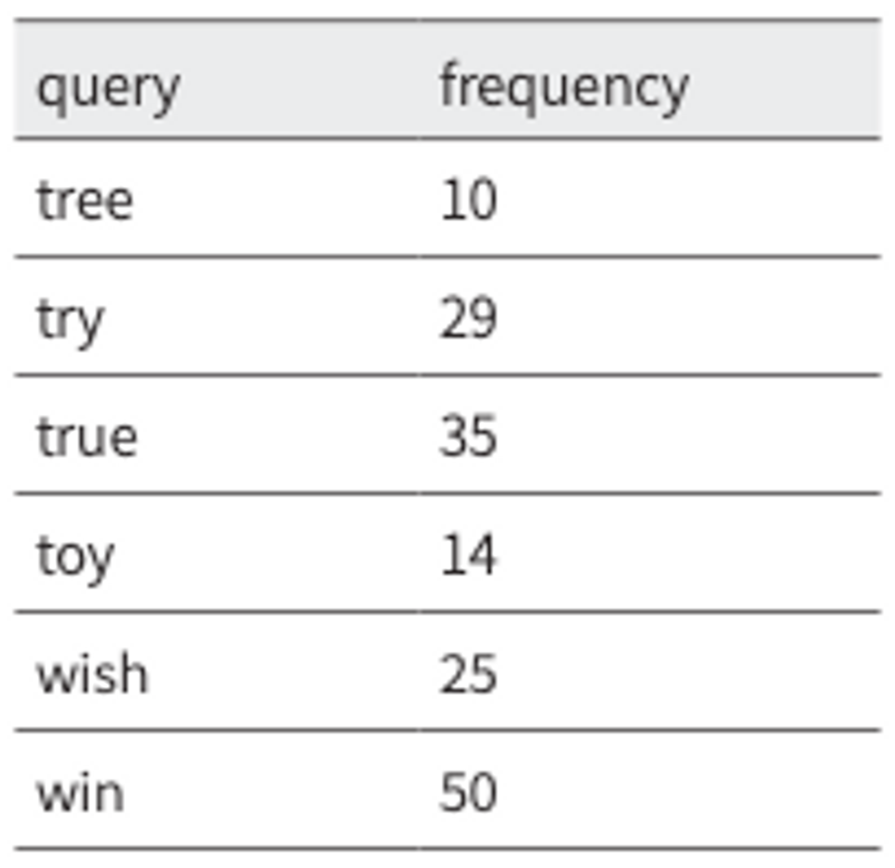

이 빈도 테이블이 있다고 하자. 이걸 트라이 노드에 저장하게 되면 다음과 같을것이다.

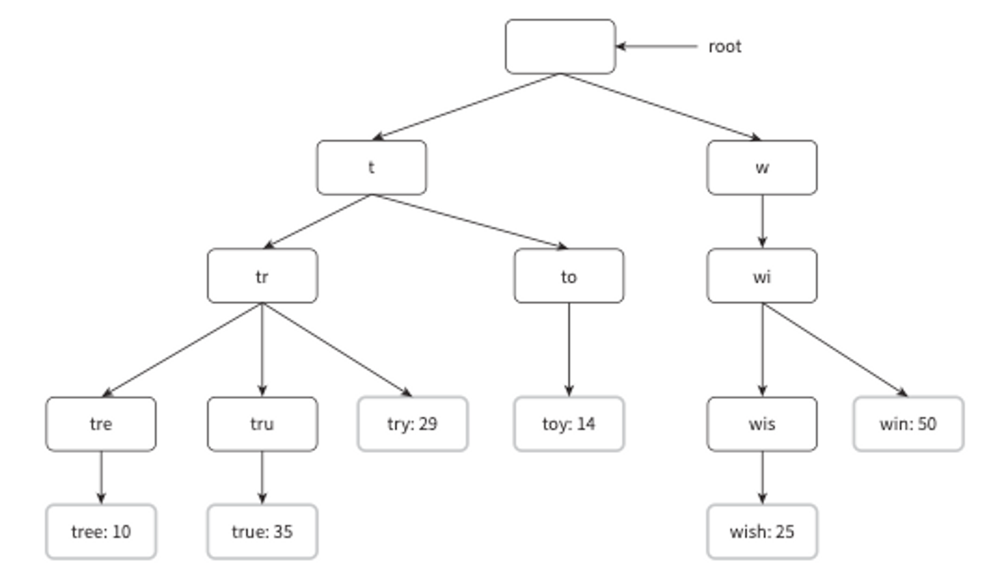

*용어정리*

- p: 접두어(prefix)의 길이
- n: 트라이 안에 있는 노드 개수
- c: 주어진 노드의 자식 노드 개수

가장 많이 사용된 질의어 k개는 다음과 같이 찾을 수 있다.

- 해당 접두어를 표현하는 노드를 찾음. 시간 복잡도는 O(p)
- 해당 노드부터 시작하는 하위 트리를 탐색하여 모든 유효 노드를 찾음.
- 시간 복잡도는 O(c)
- 유효 노드들을 정렬하여 가장 인기 있는 검색어 k개를 찾음. 시간 복잡도 O(c log c)

k=2이고 사용자가 검색창에 ‘be’를 입력했다고 하자.

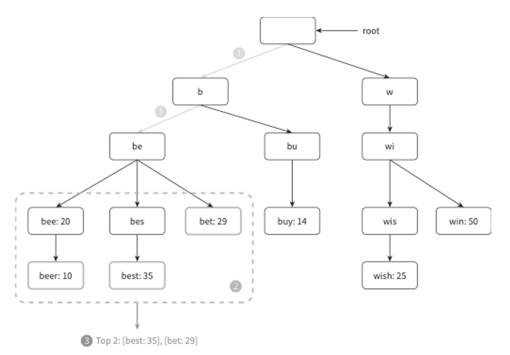

1. 접두어 노드 ‘be’를 찾음
2. 해당 노드부터 시작하는 하위 트리를 탐색하여 모든 유효 노드를 찾는다
3. 유효 노드를 정렬하여 2개만 골라낸다

이 알고리즘의 시간 복잡도는 위의 각 단계에 소요된 시간의 합이다. 즉, O(p) + O(c) + O(clogc)

이 알고리즘은 직관적이지만 최악의 경우에는 k개 결과를 얻으려고 전체 트라이를 다 검색해야 하는 일이 생길 수 있다. 해결 방법으로는 다음과 같이 있다.

1. 접두어의 최대 길이를 제한
2. 각 노드에 인기 검색어를 캐시

**접두어 최대 길이 제한**

사용자가 검색창에 긴 검색어를 입력하는 일은 거의 없음. 따라서 p값은 작은 정숫값이라고 가정해도 안전.
검색어의 최대 길이를 제한할 수 잇다면 “접두어 노드를 찾는” 단계의 시간 복잡도는 O(p)에서 O(작은 상숫값) = O(1)로 바뀔것.

**노드에 인기 검색어 캐시**

각 노드에 k개의 인기 검색어를 저장해 두면 전체 트라이를 검색하는 일을 방지할 수 있음.

각 노드에 인기 질의어를 캐시하면 검색어를 질의하는 시간 복잡도를 엄청나게 낮출 수 있다.
하지만 각 노드에 질의어를 저장할 공간이 많이 필요하게 된다는 단점도 있다.
그러나 빠른 응답속도가 아주 중요할 때  이 정도 저장공간을 희생할 만한 가치는 있다.

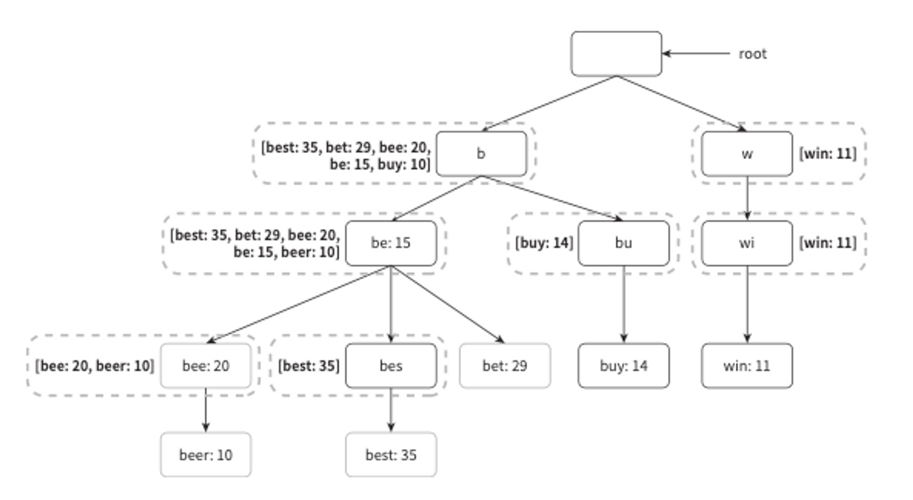

앞의 두 가지 최적화 기법을 적용함녀 시간 복잡도가 어떻게 달라지는지 알아보면 다음과 같다.

1. 접두어 노드를 찾는 시간복잡도는 O(1)로 바뀐다.
2. 최고 인기 검색어 5개를 찾는 질의의 시간 복잡도도 O(1)로 바뀐다. 검색 결과가 이미 캐시되어 있어서다.

각 단계의 시간 복잡도가 O(1)로 바뀐 덕분에, 최고 인기 검색어 k개를 찾는 전체 알고리즘의 복잡도도 O(1)로 바뀌게 된다.

### 데이터 수집 서비스

본 설계안은 사용자가 검색창에 뭔가 타이핑을 할 때마다 실시간으로 데이터를 수정함. 별로 실용적이지 못하죠? 왜냐!

- 매일 수천만 건의 질의가 입력될 텐데 그때마다 트라이를 갱신하면 질의 서비스는 심각하게 느려질 것.
- 일단 트라이가 만들어지고 나면 인기 검색어는 그다지 자주 바뀌지 않을 것. 그렇게 자주 갱신할 필요가 없음.! (→ 근데 이건 오래된 서비스만 그런듯)

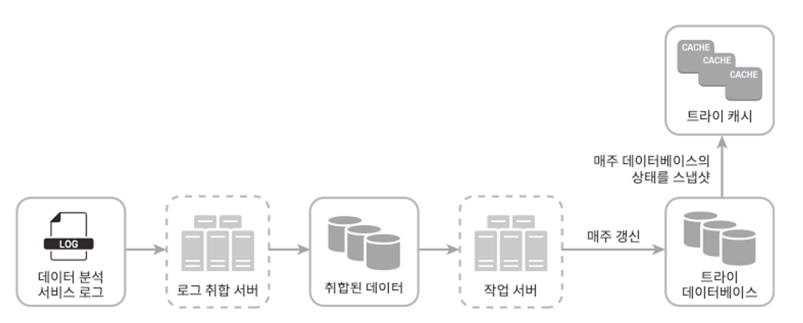

**데이터 분석 서비스 로그**

데이터 분석 서비스 로그에는 검색창에 입력된 질의에 관한 원본 데이터가 보관.
새로운 데이터가 추가될 뿐 수정은 이루어지지 않으며 로그 데이터에 인덱스를 걸지 않음.

| query | time                |
|-------|---------------------|
| tree  | 2019-10-01 22:01:01 |
| try   | 2019-10-01 22:01:05 |
| tree  | 2019-10-01 22:01:30 |
| toy   | 2019-10-01 22:02:22 |
| tree  | 2019-10-01 22:02:42 |
| try   | 2019-10-01 22:03:03 |

**로그 취합 서버**

데이터를 잘 취합하여 우리 시스템이 쉽게 소비할 수 있도록 해야함. 대부분의 경우에는 일주일에 한 번 정도로 로그를 취합해도 충분.

**취합된 데이터**

| query | time       | frequency |
|-------|------------|-----------|
| tree  | 2019-10-01 | 12000     |
| tree  | 2019-10-08 | 15000     |
| tree  | 2019-10-15 | 9000      |
| toy   | 2019-10-01 | 8500      |
| toy   | 2019-10-08 | 6256      |
| toy   | 2019-10-15 | 8866      |

매주 취합한 데이터의 사례. time 필드는 해당 주가 시작한 날짜를 나타냄. frequency 필드는 해당 질의가 해당 주에 사용된 횟수의 합.

**작업 서버**

주기적으로 비동기적 작업(job)을 실행하는 서버 집합. 트라이 자료구조를 만들고 트라이 데이터베이스에 저장하는 역할 담당.

**트라이 캐시**

트라이 캐시는 분산 캐시 시스템으로 트라이 데이터를 메모리에 유지하여 읽기 연산 성능을 높이는 구실을 함. 매주 트라이 데이터베이스의 스냅샷을 떠서 갱신

**트라이 데이터베이스**

지속성 젖아소. 트라이 데이터베이스로 사용할 수 있는 것.

1. 문서 저장소(document store): 새 트라이를 매주 만들 것이므로, 주기적으로 트라이를 직렬화하여 데이터베이스에 저장할 수 있음. (mongo DB)
2. 키-값 저장소: 트라이는 아래 로직을 적용하면 해시 테이블 형태로 변환 가능
    - 트라이에 보관된 모든 접두어를 해시 테이블 키로 변환
    - 각 트라이 노드에 보관된 모든 데이터를 해시 테이블 값으로 변환

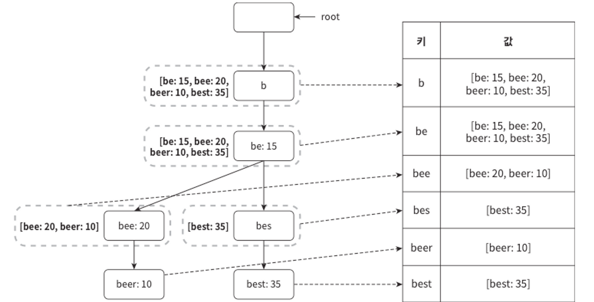

### 질의 서비스

비효율성을 개선한 새 설계안

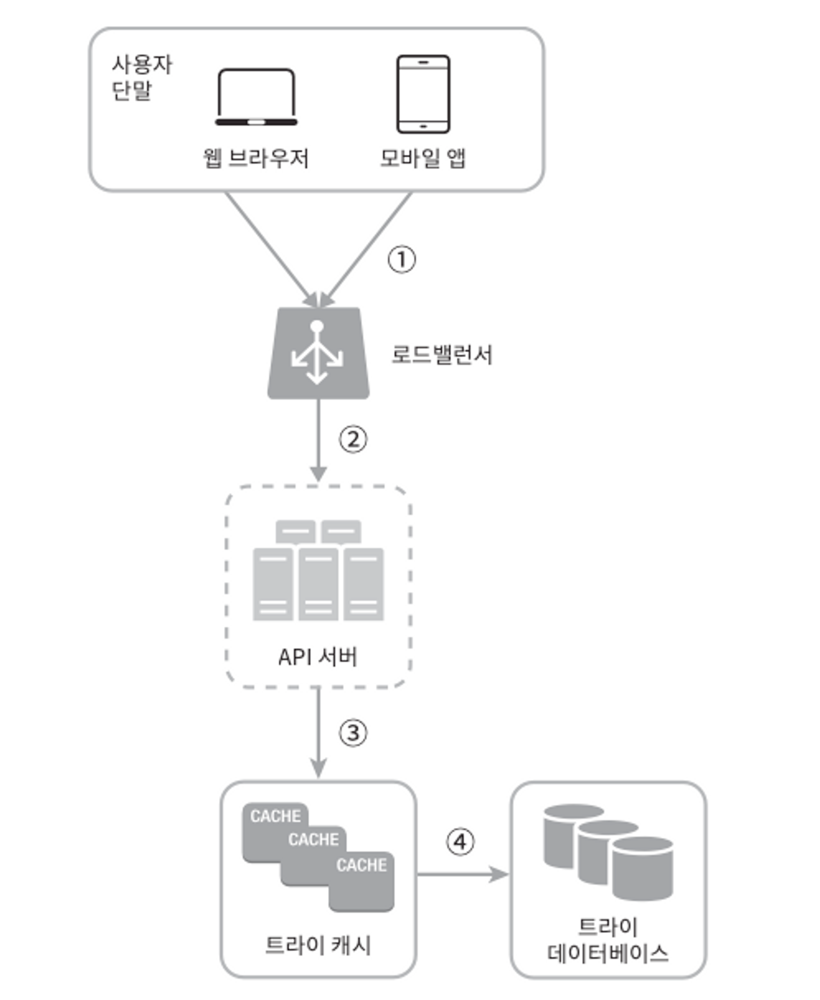

1. 검색 질의가 로드밸런서로 전송
2. 로드밸런서가 API 서버로 전송
3. API 서버는 트라이 캐시에서 데이터를 가져와 해당 요청에 대한 자동완성 검색어 제안 응답을 구성
4. 데이터가 트라이 캐시에 없는 경우에는 데이터를 데이터베이스에서 가져와 캐시에 채움. 캐시 미스(메모리 보족, 서버 장애)도 발생할 수 있음.

질의 서비스는 번개처럼 빨라야함.

- AJAX 요청(request): 웹 애플리케이션의 경우 브라우저는 보통 AJAX 요청을 보내어 자동완성된 검색어 목록을 가져옴.
- 브라우저 캐싱(browser caching): 자동완성 검색어 제안 결과는 짧은 시간 안에 자주 바뀌지 않는다. 제안된 검색어들을 브라우저 캐시에 넣어두면 후속 질의의 결과는 해당 캐시에서 바로 가져갈 수 있음. 구글 검색 엔진이 이런 캐시 메커니즘 사용. (약 1시간)
- 데이터 샘플링(data sampling): 데이터 샘플링은 **많은 양의 데이터를 대상으로 분석 작업 수행 시, 전체 데이터가 아닌 일부를 '샘플(표본)'로 선택하여 전체 데이터를 대표하게 하는 작업**. 대규모 시스템의 경우, 모든 질의 결과를 로깅하도록 해 놓으면 CPU 자원과 저장공간을 엄청나게 소진. 때문에 데이터 샘플링이 유용해요.

### 트라이 연산

**트라이 생성**

트라이 생성은 작업 서버가 담당하며, 데이터 분석 서비스의 로그나 데이터베이스로부터 취합된 데이터를 이용

**트라이 갱신**

1. 매주 한 번 갱신하는 방법. 새로운 트라이를 만든 다음에 기존 트라이를 대체.
2. 트라이의 각 노드를 개별적으로 갱신하는 방법. 트라이가 큰 대규모 설계안에서는 성능이 좋지 않음. 트라이가 작을 때는 고려해봄직한 방안. (→ 이거 잘 이해가 안돼요.)

**검색어 삭제**

혐오성이 짙거나, 폭력적이거나, 성적으로 노골적이거나, 여러 가지로 위험한 질의어를 자동완성 결과에서 제거해야함. 이를 위한 좋은 방법은 트라이 캐시 앞에 필터 계층을 두는 것.

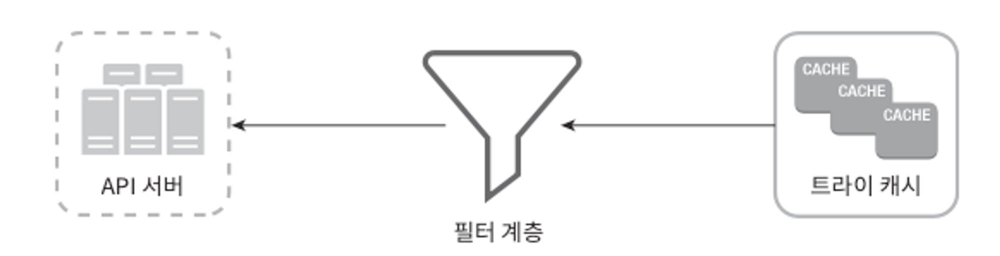

필터 계층을 두면 필터 규칙에 따라 검색 결과를 자유롭게 변경할 수 있다는 장점이 있음. 데이터베이스에서 해당 검색어를 물리적으로 삭제하는 것은 다음번 업데이트 사이클에 비동기적으로 진행하면 됨.

### 저장소 규모 확장

영어만 지원하면 되기 떄문에, 간단하게는 첫 글자를 기준으로 샤딩하는 방법을 생각해 볼 수 있다.

- 검색어를 보관하기 위해 두 대 서버가 필요하다면 ‘a’부터 ‘m’까지 글자로 시작하는 검색어는 첫 번째 서버에 저장하고, 나머지는 두 번째 서버에 저장
- 세 대 서버가 필요하다면 ‘a’부터 ‘i’까지는 첫 번째 서버에 , ‘j’부터 ‘r’까지는 두 번째 서버에, 나머지는 세 번째 서버에 저장.

이 방법을 쓰는 경우 사용 가능한 서버는 최대 26대로 제한되는데, 영어 알파벳에는 26자 밖에 없기 때문. 이 이상으로 서버 대수를 늘리려면 샤등을 계층적으로 해야함.

가령 검색어의 첫 번째 글자는 첫 번째 레벨의 샤딩에 쓰고, 두 번째 글자는 두 번째 레벨의 샤딩에 쓰는 것.
→ ex) ‘aa’ ~ ‘ag’까지는 첫 번째 서버에, ‘ah’ 부터 ’an’ 까지는 두 번째…

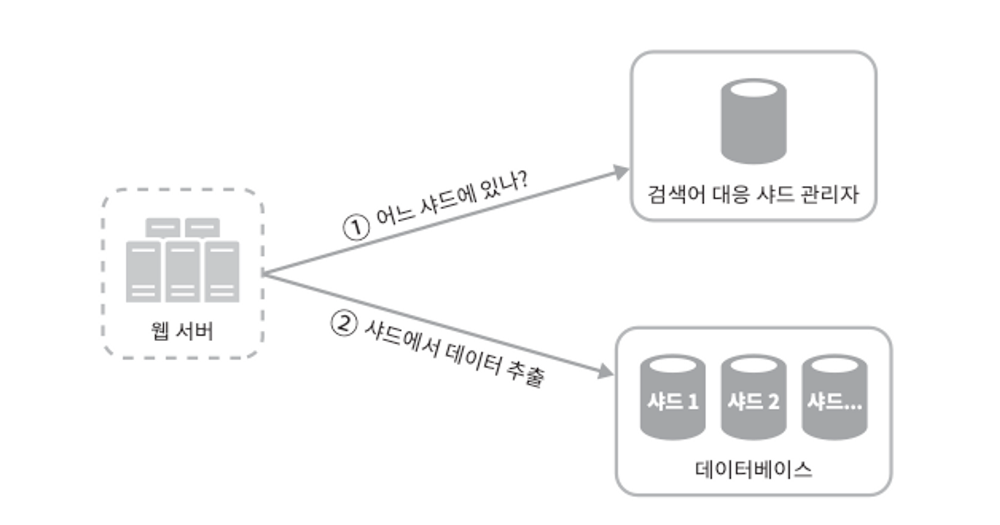

본 설계안의 경우는 과거 질의 데이터의 패턴을 분석하여 샤딩하는 방법을 제안

대응 샤드 관리자(shard map manager)는 어떤 검색어가 어느 저장소 서버에 저장되는지에 대한 정보를 관리한다

## 4단계 마무리

예상 질문들?

- 다국어 지원이 가능하도록 시스템을 확장하려면 어떻게 해야 할까요?
    - 트라이에 유니코드를 저장하면 됨.
- 국가별로 인기 검색어 순위가 다르다면 어떻게 해야 하나요?
    - 국가별로 다른 트라이를 사용하면 됨.
    - 트라이를 CDN에 저장하여 응답속도를 높일 수도 있음.
- 실시간으로 변하는 검색어의 추이를 반영하려면 어떻게 해야 하나요?
    - 새로운 뉴스 이벤트가 생긴다든가 하는 이유로 특정 검색어의 인기가 갑자기 높아질 수 있음.
    - 본설계안은 지원하기 어려움. 왜냐?
        - 작업 서버가 매 주 한 번씩만 돌아가게 해놓음.
        - 설사 때 맞춰 동작하더라도 트라이를 구성하는데 시간이 많이 듦

몇 가지 더 얘기 나눠볼 수 있는 것.

- 샤딩을 통해서 작업 대상 데이터의 양을 줄임.
- 순위 모델(ranking model)를 바꾸어 최근 검색어에 보다 높은 가중치를 주도록 함.
- 데이터가 스트림 형태로 올 수 있다는 점, 즉 한번에 모든 데이터를 동시에 사용할 수 없을 가능성이 있다는 점을 고려해야 함.
