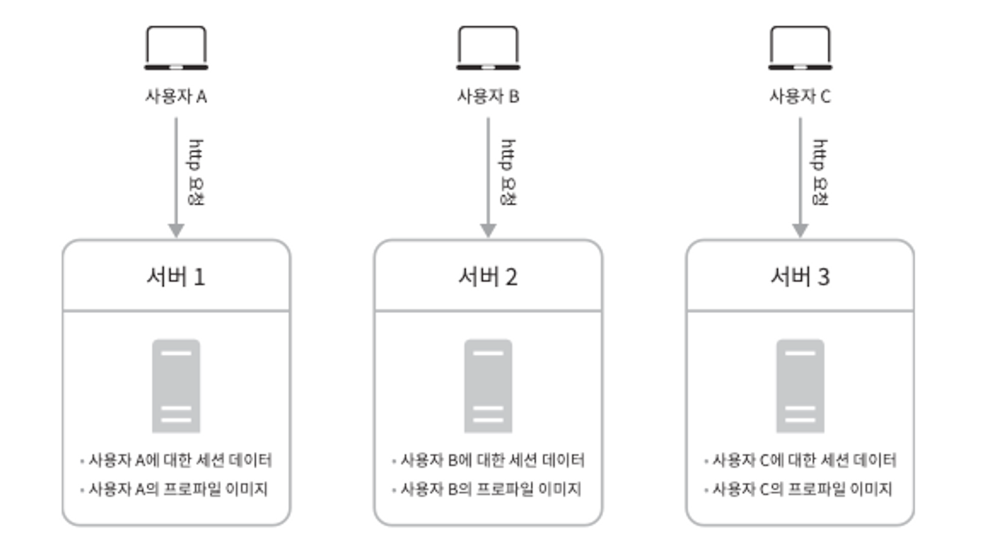

> 이 장을 통해, 규모 확장성과 관계된 설계 문제를 푸는 데 쓰일 유용한 지식들을 마스터할 수 있습니다.
>

## 단일 서버

단일 서버는 웹 앱, 데이터베이스, 캐시 등이 전부 한 대에서 실행된다.

1. 사이트 접속
2. DNS 조회 결과로 IP 주소 반환
3. 해당 주소로 HTTP 요청 전달
4. 요청 받은 웹 서버는 HTML 페이지나 JSON 형태의 응답을 반환

---

## 데이터베이스

사용자가 늘면 서버 하나로는 충분하지 않아서 여러 서버를 두어야 한다.
웹/모바일 트래픽 처리 서버(웹 계층)와 데이터베이스 서버(데이터 계층) 를 분리하면 그 각각을 독립적으로 확장해 나갈 수 있게 된다.

### **어떤 데이터베이스를 사용할 것인가?**

⇒ SQL과 NoSQL에 대한 정의를 다룬다

선택 가이드 (NoSQL을 선택하는 바람직한 이유)

- 아주 낮은 응답 지연시간(latency)이 요구됨
- 다루는 데이터가 비정형(unstructured)이라 관계형 데이터가 아님
- 데이터(JSON, YAML, XML 등)를 직렬화하거나 역직렬화 할 수 있기만 하면 됨
- 아주 많은 양의 데이털르 저장할 필요가 있음

---

## 수직적 규모 확장 vs 수평적 규모 확장

- Scale-up : 수직적 규모 확장 프로세스는 서버에 고사양 자원을 추가하는 행위를 말한다.
- Sacle-out : 수평적 규모 확장 프로세스는 더 많은 서버를 추가하여 성능을 개선하는 행위를 말한다.

대규모 애플리케이션을 지원하는 데는 수평적 규모 확장법이 적절하다. 그 이유는 다음과 같다.

- 수직적 규모 확장에는 한계가 있다. 한 대의 서버에 CPU나 메모리를 무한대로 증설할 방법은 없다.
- 수직적 규모 확장법은 장애에 대한 자동복구 방안이나 다중화 방안을 제시하지 않는다. 서버에 장애가 ㅏㅂㄹ생하면 웹사이트/앱은 완전히 중단된다.

앞서 본 설계에서 사용자는 웹 서버에 바로 연결된다. 웹 서버가 다운되면 사용자는 웹 사이트에 접속할 수 없다. 또한, 너무 많은 사용자가 접속하여 웹 서버가 한계 상황에 도달하게 되면 응답 속도가 느려지거나 서버 접속이 불가 능해질 수도 있다. 이런 문제를 해결하는 데는 부하 분산기 또는 로드밸런서 (load balancer)를 도입하는 것이 최선이다.

### **로드밸런서**

- 사용자는 로드밸런서의 공개 IP(public IP address) 주소로 접속한다.
  → 웹 서버는 클라이언트의 접속을 직접 처리하지 않는다.
- 더 나은 보안을 위해, 서버 간 통신에는 사설 IP(private IP address) 주소가 이용된다.
- 사설 IP 주소는 같은 네트워크에 속한 서버 사이의 통신에만 쓰일 수 있는 IP 주소로, 인터넷을 통해서는 접속할 수 없다.

부하 분산 집합에 또 하나의 웹 서버를 추가하고 나면 장애를 자동복구하지 못하는 문제는 해소되며, 웹 계층의 가용성은 향상된다.

### **데이터베이스 다중화**

- 많은 데이터베이스 관리 시스템이 다중화를 지원한다. 보통은 서버 사이에 주(master)-부(slave) 관계를 설정하고 데이터 원본은 주 서버에, 사본은 부 서버에 저장하는 방식이다.
- 쓰기 연산은 마스터에서만 지원한다. 부 데이터베이스는 주 데이터베이스로부터 그 사본을 전달받으며, 읽기 연산만을 지원한다. 데이터베이스를 변경하는 명령어들은 주 데이터베이스로만 전달되어야 한다.
- 대부분의 애플리케이션은 읽기 연산의 비중이 쓰기 연산보다 훨씬 높다. 따라서 통상 부 데이터베이스의 수가 주 데이터베이스의 수보다 많다.

데이터베이스 다중화의 장점

- 더 나은 성능
    - 읽기 연산은 부 데이터베이스 서버들로 분산된다. 병령로 처리될 수 있는 질의(query)의 수가 늘어나므로, 성능이 좋아진다
- 안정성
    - 데이터베이스 서버 가운데 일부가 파괴되어도 데이터는 보존될 것이다.
    - 데이터를 지역적으로 떨어진 여러 장소에 다중화시켜 놓을 수 있기 때문이다.
- 가용성
    - 데이터를 여러 지역에 복제해 둠으로써, 하나의 데이터 베이스 서버에 장애가 발생하더라도 다른 서버에 있는 데이터를 가져와 계속 서비스할 수 있게 된다.

---

## 캐시

캐시는 값비싼 연산 결과 또는 자주 참조되는 데이터를 메모리 안에 두고, 뒤이은 요청이 보다 빨리 처리될 수 있도록 하는 저장소이다.

### 캐시 계층

캐시 계층(cache tier)은 데이터가 잠시 보관되는 곳으로 데이터베이스보다 훨씬 빠르다.

별도의 캐시 계층을 두면 성능이 개선될 뿐 아니라 데이터베이스의 부하를 줄일 수 있고, 캐시 계층의 규모를 독립적으로 확장시키는 것도 가능해진다.

읽기 주도형 캐시 전략(read-through caching strategy)등의 다양한 캐시 전략이 있는데, 캐시할 데이터 종류, 크기, 액세스 패턴에 맞는 캐시 전략을 선택하면 된다.

[6]을 참조하라는데 뭔소리임?

→ Caching Strategies and How to Choose the Right One: https://codeahoy.
com/2017/08/11/caching-strategies-and-how-to-choose-the-right-one/

### 캐시 사용 시 유의할 점

- 캐시는 어떤 상황에 바람직한가?

  → 데이터 갱신은 자주 일어나지 않지만 참조는 빈번하게 일어날 때.

- 어떤 데이터를 캐시에 두어야 하는가?

  → 캐시는 데이터를 휘발성 메모리에 두므로, 영속적으로 보관할 데이터를 캐시에 두는 것은 바람직하지 않다.

  → 지속적 저장소에 두어야할 데이터는 캐시에 두는 것이 적합하지 않다.

- 캐시에 보관된 데이터는 어떻게 만료되는가?

  → 만료 기한은 너무 짧아도 곤란하고, 너무 길어도 곤란하기 때문에 이에 대한 정책을 마련해 두어야한다.

  → 만료 정책이 없으면 데이터는 캐시에 계속 남게 된다.

- 일관성은 어떻게 유지되는가?

  → 일관성은 데이터 저장소의 원본과 캐시 내의 사본이 같은지 여부다.

  → 저장소의 원본을 갱신하는 연산과 캐시를 갱신하는 연산이 단일 트랜잭션으로 처리되지 않는 경우 이 일관성은 깨질 수 있다. (트랜잭션 처리 범위를 잘 생각해야한다?)

  → 여러 지역에 걸쳐 시스템을 확장해 나가는 경우 캐시와 저장소 사이의 일관성을 유지하는 것은 어려운 문제가 된다.

- 장애에는 어떻게 대처할 것인가?

  

  → 캐시 서버를 한 대만 두는 경우 해당 서버는 단일 장애 지점(Single Point of Failure, SPOF)이 되어버릴 가능성이 있다.

  → 결과적으로 SPOF를 피하려면 여러 지역에 걸쳐 캐시 서버를 분산시켜야 한다.

- 캐시 메모리는 얼마나 크게 잡을 것인가?

  (패턴에 따라 달라진다는걸 말하고 싶은건가?)

  → 캐시 메모리가 너무 작으면 액세스 패턴에 따라서는 데이터가 너무 자주 캐시에서 밀려나버려 캐시의 성능이 떨어지게 된다.
  → 이 같은 경우에 막을 방법은 캐시 메모리를 과할당하는 것이다.

- 데이터 방출(eviction) 정책은 무엇인가?

  → 캐시가 꽉 차버리면 추가로 캐시에 데이터를 넣어야 할 경우 기존 데이터를 내보내야하는 것을 캐시 데이터 방출 정책이라고 한다.

  → 가장 널리 쓰이는 것은 LRU(Least Recently Used) - 마지막으로 사용된 시점이 가장 오래된 데이터를 내보내는 정책)이다.
  → 다른 정책으로는 LFU(Least Frequently Used - 사용된 빈도가 가장 낮은 데이터를 내보내는 정책)나 FIFO(First In First Out - 가장 먼저 캐시에 들어온 데이터를 가장 먼저 내보내는 정책) 등등이 있다.

---

## 콘텐츠 전송 네트워크(CDN)

CDN은 정적 콘텐츠를 전송하는 데 쓰이는, 지리적으로 분산된 서버의 네트워크이다.
이미지, 비디오, CSS, JavaScript 파일 등을 캐시할 수 있다.

1. 사용자가 이미지 URL을 통해 이미지에 접근한다
2. CDN 서버의 캐시에 해당 이미지가 없는 경우, 서버는 원본 서버에 요청하여 파일을 가져온다.
3. 원본 서버가 파일을 CDN 서버에 반환한다. 응답의 HTTP 헤더에는 해당 파일이 얼마나 오래 캐시될 수 있는지를 설명하는 TTL(Time-To-Live) 값이 들어있다.
4. CDN 서버는 파일 캐시하고 사용자에게 반환한다. 이미지는 TTL에 명시된 시간이 끝날 때까지 캐시된다.
5. 다른 사용자가 같은 이미지에 대한 요청을 CDN 서버에 전송한다.
6. 만료되지 않은 이미지에 대한 요청은 캐시를 통해 처리한다.

### CND 사용 시 고려해야 할 사항

- 비용
    - CDN은 보통 제3 사업자에 의해 운여오디며, 여러분은 CDN으로 들어가고 나가는 데이터 전송 양에 따라 요금을 내게 된다.
    - 자주 사용되지 않는 콘텐츠를 캐싱하는 것은 이득이 크지 않으므로, CDN에서 빼는 것을 고려하도록 하자
- 적절한 만료 시한 설정
    - 시의성이 중요한 콘텐츠의 경우 만료 시점을 잘 정해야 한다.
    - 너무 길지도 않고 짧지도 않아야 하는데, 너무 길면 콘텐츠의 신선도는 떨어질 것이고, 너무 짧으면 원본 서버에 빈번히 접속하게 되어서 좋지 않다.
- CDN 장애에 대한 대처 방안
    - CDN 장애에 대한 문제를 감지하여 원본 서버로부터 직접 콘텐츠를 가져오도록 클라이언트를 구성하는 것이 필요할 수 있다.

변화된 부분

1. 정적 콘텐츠는 더 이상 웹 서버를 통해 서비스하지 않으며, CDN을 통해 제공하여 더 나은 성능을 보장
2. 캐시가 데이터베이스 부하를 줄여줌

## 무상태(stateless) 웹 계층

웹 계층을 수평적으로 확장하기 위해서는 상태 정보(사용자 세션 데이터와 같은)를 웹 계층에서 제거하여야 한다.

바람직한 전략은 상태 정보를 관계형 데이터베이스나 NoSQL 같은 지속성 저장소에 보관하고, 필요할 때 가져오도록 하는 것이다.

이렇게 구성된 웹 계층을 무상태 웹 계층이라 부른다.

### 상태 정보 의존적인 아키텍처

- 상태를 유지하여 요청들 사이에 공유되도록 한다. 위 그림은 상태 정보 의존적인 아키텍처를 보여준다.
- 같은 클라이언트로부터의 요청은 항상 같은 서버로 전송되어야 한다.
- 대부분의 로드밸런서가 이를 지원하기 위해 고정 세션이라는 기능을 제공하고 있는데, 이는 로드밸런서에 부단을 준다.
- 게다가 로드밸런서 뒷단에 서버를 추가하거나 제거하기도 까다로워진다.

### 무상태 아키텍처

- 사용자로부터의 HTTP 요청은 어떤 웹 서버로도 전달될 수 있다.
- 웹 서버는 상태 정보가 필요할 경우 공유 저장소로부터 데이터를 가져온다.
  → 따라서 상태 정보는 웹서버로부터 물리적으로 분리되어 있다.

- 우리는 세션 데이터를 웹 계층에서 분리하고 지속성 데이터 보관소에 저장하도록 만들었다.
- 이 공유 저장소는 관계형 데이터베이스일 수도 있고, Memcached/Redis 같은 캐시 시스템일 수도 있으며, NoSQL일 수도 있다.

---

## 데이터 센터

- 위 사진은 두 개의 데이터 센터를 이용하는 사례이다. (데이터 센서 = aws ec2 instance 느낌)
- 장애가 없는 상황에서 사용자는 가장 가까운 데이터 센터로 안내된느데, 통상 이 절차를 지리적 라우팅이라도 부른다.
- 이들 데이터 센터 중 하나에 심각한 장애가 발생하면 모든 트래픽은 장애가 없는 데이터 센터로 전송된다.

다중 데이터 센터 아키텍처를 만들려면 몇 가지 기술적 난제를 해결해야한다

- 트래픽 우회
    - 올바른 데이터 센터로 트래픽을 보내는 효과적인 방법을 찾아야한다.
- 데이터 동기화
    - 데이터 센터마다 별도의 데이터베이스를 사용하고 있는 상황이라면, 장애가 자동으로 복구되어 트래픽이 다른 데이터베이스로 우회된다 해도, 해당 데이터센터에는 찾는 데이터가 없을 수 있다.
    - 넷플릭스가 여러 데이터센터에 걸쳐 데이터를 어떻게 다중화하는지 관심이 있다면 [11]을 읽어보기 바란다.
    - Active-Active for Multi-Regional Resiliency: https://netflixtechblog.com/active-active-for-multi-regional-resiliency-c47719f6685b
- 테스트와 배포
    - 여러 데이터 센터를 사용하도록 시스템이 구성된 상황이라면 웹 사이트 또는 애플리케이션을 여러 위치에서 테스트해보는 것이 중요하다.
    - 한편, 자동화된 배포 도구는 모든 데이터 센터에 동일한 서비스가 설치되도록 하는 데 중요한 역할을 한다.

---

## 메시지 큐

메시지 큐는 메시지의 무손실(durability, 즉 메시지 큐에 일단 보관된 메시지는 소비자가 꺼낼 때까지 안전히 보관된다는 특성)을 보장하는, 비동기 통신(asynchronous communication)을 지원하는 컴포넌트다.

메시지의 버퍼 역할을 하며, 비동기적으로 전송한다. 메시지 큐의 기본 아키텍처는 간단하다. 생산자 또는 발행자(producer/publisher)라고 불리는 입력 서비스가 메시지를 만들어 메시지 큐에 발행(publish)한다.

큐에는 보통 소비자 혹은 구독자(consumer/subscriber)라 불리는 서비스 혹은 서버가 연결되어 있는데, 메시지를 받아 그에 맞는 동작을 수행하는 역할을 한다.

메시지 큐를 이용하면 서비스 또는 서버 간 결합이 느슨해져서, 규모 확장성이 보장되어야 하는 안정적 애플리케이션을 구성하기 좋다. 생산자는 소비자 프로세스가 다운되어 있어도 메시지를 발행할 수 있고, 소비자는 생산자 서비스가 가용한 상태가 아니더라도 메시지를 수신할 수 있다.

---

## 로그, 메트릭 그리고 자동화

- 로그
    - 에러 로그를 모니터링하는 것은 중요하다.
    - 시스템의 오류와 문제들을 보다 쉽게 찾아낼 수 있도록 하기 때문이다.
    - 에로 로그는 서버 단위로 모니터링 할 수도 있지만, 로그를 단일 서비스로 모아주는 도구를 활용하면 더 편리하게 검색하고 조회할 수 있다.
- 메트릭 (= 시각화?)
    - 메트릭을 잘 수집하면 사업 현황에 관한 유용한 정보를 얻을 수도 있고, 시스템의 현재 상태를 손쉽게 파악할 수도 있다.
    - 유용한 메트릭 종류
        - 호스트 단위 매트릭 : CPU, 메모리, 디스크 I/O에 관한 메트릭
        - 종합 메트릭 : 데이터베이스 계층의 성능, 캐시 계층의 성능 같은 것이 여기 해당한다.
        - 핵심 비즈니스 메트릭 : 일별 능동 사용자, 수익, 재방문 같은 것이 여기 해당한다.
- 자동화
    - 시스템이 크고 복잡해지면 생산성을 높이기 위해 자동화 도구를 활용해야한다.
    - 가령 지속적 통합을 도와준느 도구를 활용하면 개발자가 만든느 코드가 어떤 검증 절차를 거치도록 할 수 있어서 문제를 쉽게 감지할 수 있다.
    - 이 외에도 빌드, 테스트, 배포 등의 절차를 자동화할 수 있어서 개발 생산성을 크게 향상시킬 수 있다.

### 메시지 큐, 로그, 메트릭, 자동화 등을 반영하여 수정한 설계안

---

## 데이터베이스의 규모 확장

### 수직적 확장

수직적 접근법의 몇 가지 심각한 약점

- 데이터베이스 서버 하드웨어에는 한계가 있으므로 CPU, RAM 등을 무한 증설할 수는 없다. 사용자가 계속 늘어나면 한 대 서버로는 결국 감당하기 어렵게 될 것이다.
- SPOF로 인한 위험성이 크다
- 비용이 많이 든다. 고성능 서버로 갈수록 가격이 올라가기 마련이다.

### 수평적 확장

데이터 베이스의 수평적 확장은 샤딩이라고도 부르는데, 더 많은 서버를 추가함으로써 성능을 향상시킬 수 있도록 한다.

샤딩은 대규모 데이터베이스를 샤드라고 부르는 작은 단위로 분할하는 기술을 일컫는다. 모든 샤드는 같은 스키마를 쓰지만 샤드에 보관되는 데이터 사이에는 중복이 없다.

샤딩 전략을 구현할 때 고려해야 할 가장 중요한 것은 샤딩 키를 어떻게 정하느냐 하는 것이다. 샤딩 키는 파티션 키라고도 부르는데, 데이터가 어떻게 분산될지 정하는 하나 이상의 칼럼으로 구성된다.

샤딩 키를 통해 올바른 데이터베이스에 질의를 보내어 데이터 조회나 변경을 처리하므로 효율을 높일 수 있다. 샤딩 키를 정할 때는 데이터를 고르게 분할 할 수 있도록 하는 게 가장 중요하다.

샤딩 도입 시 풀어야 할 새로운 문제들

- 데이터의 재 샤딩(resharding)
    - 재 샤딩은 다음과 같은 경우에 필요하다.
        1. 데이터가 너무 많아져서 하나의 샤드로는 더 이상 감당하기 어려울 때
        2. 샤드 간 데이터 분포가 균등하지 못하여 어떤 샤드에 할당된 공간 소모가 다른 샤드에 비해 빨리 진행될 때
    - 샤드 소진이라고도 부르는 이런 현상이 발생하면 샤드 키를 계산하는 함수를 변경하고 데이터를 재배치하여야 한다
- 유명인사 문제
    - 핫스팟 키 문제라고도 부르는데, 특정 샤드에 질의가 집중되어 서버에 과부하가 걸리는 문제이다
    - 유명인사들이 같은 샤드에 들어가있는 데이터로 사회 관계망 애플리케이션(SNS)을 구축하게 되면 결국 해당 샤드에는 read 연산 때문에 과부하가 걸리게 될 것이다.
    - 이 문제를 풀려면 위에 나열한 유명인사 각각에 샤드 하나씩을 할당해야 할 수도 있고, 심지어는 더 잘게 쪼개야 할 수도 있다.
- 조인과 비정규화
    - 일단 하나의 데이터베이스를 여러 샤드 서버로 쪼개고 나면, 여러 샤드에 걸친 데이터를 조인하기가 힘들어진다.
    - 이를 해결하는 한 가지 방법은 데이터베이스를 비정규화하여 하나의 테이블에서 질의가 수행될 수 있도록 하는 것이다.

---

## 백만 사용자, 그리고 그 이상

- 웹 계층은 무상태 계층으로
- 모든 계층에 다중화 도입
- 가능한 한 많은 데이터를 캐시할 것
- 여러 데이터 센터를 지원할 것
- 정적 콘텐츠는 CDN을 통해 서비스할 것
- 데이터 계층은 샤딩을 통해 그 규모를 확장할 것
- 각 계층은 독립적 서비스로 분할할 것
- 시스템을 지속적으로 모니터링하고, 자동화 도구들을 활용할 것

---

뭔가 기본 인프라에 대해서 하나씩 설명하고 짚어보는 시간이었던것같다.
