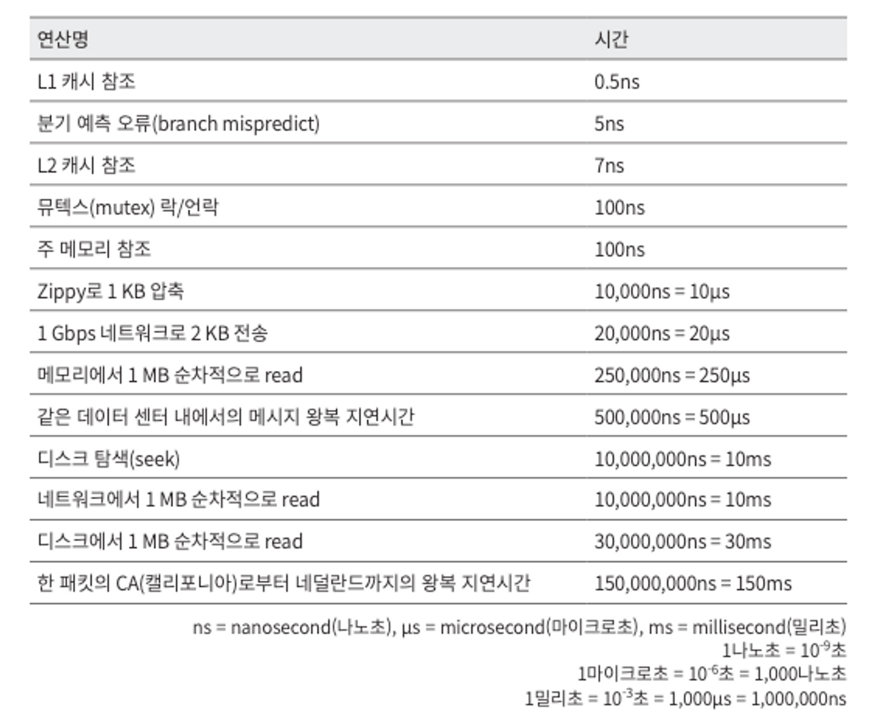
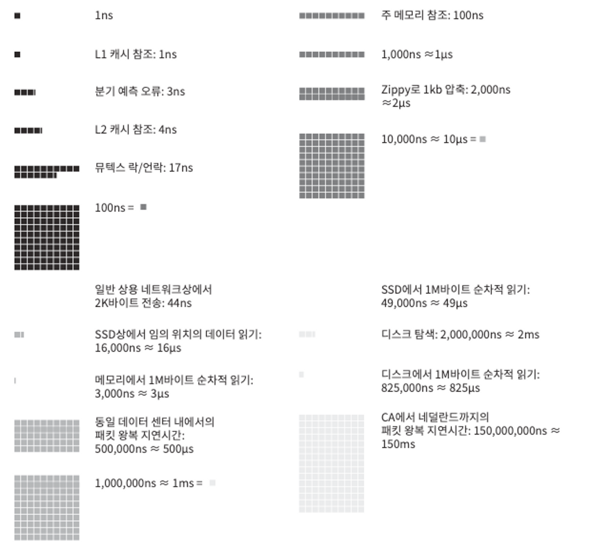

> “개략적인 규모 추정(back-of-the-envelope esti-mation)”은 보편적으로 통용되는 성능 수치상에서 사고 실험을 행하여 추정치를 계산하는 행위로서, 어떤 설계가 요구사항에 부합할 것인지 보기 위한 것이다.
개략적 규모 추정을 효과적으로 해 내려면 규모 확장성을 표현하는 데 필요한 기본기에 능숙해야 한다. 특히, 2의 제곱수나 응답지연 값, 그리고 가용성에 관계된 수치들을 기본적으로 잘 이해하고 있어야 한다.
>

## 2의 제곱수

최소 단위는 1바이트이고, 8비트로 구성된다. ASCII 문자 하나가 차지하는 메모리 크기가 1바이트이다.

| 2의 x 제곱 | 근사치                | 이름               | 축약형 |
|---------|--------------------|------------------|-----|
| 10      | 1천(thousand)       | 1킬로바이트(Kilobyte) | 1KB |
| 20      | 1백만(million)       | 1메가바이트(Megabyte) | 1MB |
| 30      | 10억(billion)       | 1기가바이트(Gigabyte) | 1GB |
| 40      | 1조(trillion)       | 1테라바이트(Terabyte) | 1TB |
| 50      | 1000조(quadrillion) | 1페타바이트(Petabyte) | 1PB |

---

## 모든 프로그래머가 알아야 하는 응답지연 값

이 수치들은 컴퓨터 연산들의 처리 속도가 어느 정도인지 짐작할 수 있도록 해 준다

왼쪽 수들의 표를 알기 쉽게 시각화하기 위해, 한 엔지니어가 개발한 도구로 시각화 수치를 보여주건데 봐도 모르겠는뎁쇼?

어찌됐든 저 위의 표들을 분석해본 결과 유추해 낼 수 있는 점

- 메모리는 빠르지만 디스크는 아직도 느리다
- 디스크 탐색(seek)은 가능한 한 피하라.
- 단순한 압축 알고리즘은 빠르다.
- 데이터를 인터넷으로 전송하기 전에 가능하면 압축하라
- 데이터 센터는 보통 여러 지역(region)에 분산되어 있고, 센터들 간에 데이터를 주고받는 데는 시간이 걸린다

## 가용성에 관계된 수치들

고가용성(high availability)은 시스템이 오랜 시간 동안 지속적으로 중단 없이 운영될 수 있는 능력을 지칭하는 용어이다.

고가용성을 표현하는 값은 퍼센트 (percent)로 표현하는데, 100%는 시스템이 단 한 번도 중단된 적이 없었음을 의미한다. 대부분의 서비스는 99%에서 100% 사이의 값을 갖는다.

SLA(Service Level Agreement)는 서비스 사업자(service provider)가 보편적 으로 사용하는 용어로, 서비스 사업자와 고객 사이에 맺어진 합의를 의미한다.
이 합의에는 서비스 사업자가 제공하는 서비스의 가용시간(uptime)이 공식적 으로 기술되어 있다.

아마존, 구글, 그리고 마이크로소프트 같은 사업자는 99% 이상의 SLA를 제공한다. 가용시간은 관습적으로 숫자 9를 사용해 표시한다. 9가 많으면 많을수록 좋다고 보면 된다.

## 팁

개략적인 규모 추정과 관계된 면접에서 가장 중요한 것은 **문제를 풀어 나가는 절차**다. **올바른 절차를 밟느냐**가 ~~결과를 내는 것~~보다 **중요**하다. 면접자가 보고 싶어 하는 것은 여러분의 **문제 해결 능력**일 것이다.

- 근사치를 활용한 계산
    - 면접장에서 복잡한 계산을 하는 것은 어려운 일이다. 예를 들어, “99987/9.1”의 계산 결과는 무엇인가? 그러나 이런 데 시간을 쓰는 것은 낭비다.
      → 계산의 정확성을 평가하는 것이 목적이 아니라서.
      그러니 “99987/9.1”은 “100000/10”으로 간소화할 수 있다
- 가정들은 적어두라. 나중에 살펴볼 수 있도록 (아마 왜 이렇게 짰는지 확인할 수 있도록하라는듯 tdd…?)
- 단위를 붙어라. 5라고면 적으면 5KB인지, 5MB인지 자신조차 헷갈리게 될 것이다. (습관을 들여놓는게 좋다)
- 많이 출제되는 개략적 규모 추정 문제는 QPS, 최대 QPS, 저장소 요구량, 캐시 요구량, 서버 수 등을 추정하는 것
