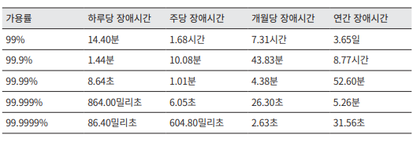

## 2의 제곱수
### 개요
- 프로그래머가 알아야하는 데이터 단위
### 데이터 볼륨 단위
- 2^10 : 1KB
- 2^20 : 1MB
- 2^30 : 1GB
- 2^40 : 1TB
- 2^50 : 1PB
## 모든 프로그래머가 알아야 하는 응답지연 값
### 개요
- 데이터 처리, 연산의 처리 속도를 알면 시스템 설계 중 발생하는 병목에 대한 대략적인 계산이 가능
### 대략적인 응답지연 값
- 빠른 컴퓨터 등장으로 유효하진 않지만 아직 짐작하기 좋은 수치
#### 표

### 수치 분석 결론
- 메모리는 빠르고 디스크는 느리다.
- 디스크 탐색은 가능한 피하라.
- 단순 압축 알고리즘은 빠르다.
- 데이터 전송 전 가능한 압축하라.
- 데이터 센터는 여러지역에 분산되어 있고 각각 데이터를 주고받는데는 시간이 걸린다.
## 가용성에 관계된 수치들
### 개요
- 시스템이 오랜 시간 중단 없이 운영 되기 위한 수치를 표현하는 방법
### 가용률
- 가용시간은 관습적으로 숫자 9를 사용해 표시
#### 표

## 팁
### 개요
- 개략적인 규모 추정에 중요한 부분은 결과보단 올바른 절차를 밟는지가 중요하다
#### 팁
- 근사치를 활용한 계산
- 가정은 기록
- 단위를 항상 붙일것
- QPS, 최대 QPS, 저장소 요구량, 캐시 요구량, 서버 수 추정 등 개략적 규모 추정 방법 연습