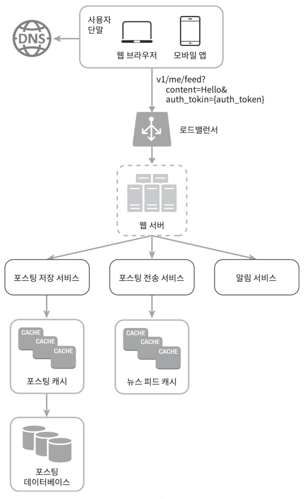

> 면접은 여러분의 설계 기술을 시연하는 자리이고, 설계 과정에서 내린 결정들에 대한 방어 능력을 보이는 자리이며, 면접관의 피드백을 건설적인 방식으로 처리할 자질이 있음을 보이는 자리인 것이다.
>

## 효과적 면접을 위한 4단계 접근법

### 1단계 문제 이해 및 설계 범위 확정

> 요구사항을 완전히 이해하지 않고 답을 내놓는 행위는 아주 엄청난 부정적 신호(red flag)다. 면접은 퀴즈 쇼가 아니며, 정답 따위는 없다는 걸 상기 하자.
그러니 바로 답부터 들이밀지 말라. 속도를 늦춰라. 깊이 생각하고 질문하여 요구사항과 가정들을 분명히 하라. 이 단계의 중요성은 강조하고 또 강조해도 모자람이 없다.
>

**엔지니어가 가져야할 가장 중요한 기술 중 하나는 올바른 질문을 하는 것, 적절한 가정을 하는 것, 시스템 구축에 필요한 것을 모으는 것.**

요구사항을 정확히 이해하는 데 필요한 질문은 다음과 같이 생각해볼 수 있을 것 이다

- 구체적으로 어떤 기능들을 만들어야 하나?
- 제품 사용자 수는 얼마나 되나?
- 회사의 규모는 얼마나 빨리 커지리라 예상하나? 석 달, 여섯 달, 일년 뒤의 규모는 얼마가 되리라 예상하는가?
- 회사가 주로 사용하는 기술 스택(technology stack)은 무엇인가? 설계를 단순화하기 위해 활용할 수 있는 기존 서비스로는 어떤 것들이 있는가?

### 2단계 개략적인 설계안 제시 및 동의 구하기

> 이번 단계에서 초점을 맞추어야 할 것은 개략적인 설계안을 제시하고 면접관 의 동의를 얻는 것이다. 이 과정은 면접관과 협력하며 진행하면 좋다.
>
- 설계안에 대한 최초 청사진을 제시하고 의견을 구하라. 면접관을 마치 팀원인 것처럼 대하라.
- 화이트보드나 종이에 핵심 컴포넌트를 포함하는 다이어그램을 그려라.
- 이 최초 설계안이 시스템 규모에 관계된 제약사항들을 만족하는지를 개략적으로 계산해 보라. 계산 과정은 소리 내어 설명하라. 아울러, 이런 개략적 추정이 필요한지는 면접관에게 미리 물어보도록 하자.

### 3단계 상세 설계

이 단계로 왔다면 여러분은 면접관과 다음 목표는 달성한 상태일 것이다

- 시스템에서 전반적으로 달성해야 할 목표와 기능 범위 확인
- 전체 설계의 개략적 청사진 마련
- 해당 청사진에 대한 면접관의 의견 청취
- 상세 설계에서 집중해야 할 영역들 확인

이제 해야할 일들

1. 설계 대상 컴포넌트 사이의 우선순위를 정하는 것
2. 면접관이 여러분이 집중 했으면 하는 영역을 알려 주기도 한다
3. 시스템의 성능 특성에 대한 질문을 던질 것이 고, 그 경우 질문 내용은 시스템의 병목 구간이나 자원 요구량 추정치에 초점 이 맞춰져 있을 것

대부분의 경우 면접관은 여러분이 특정 시스템 컴포넌 트들의 세부사항을 깊이 있게 설명하는 것을 보길 원한다.

### 4단계 마무리

면접관은 후속 질문을 던질 수도 있고, 스스로 추가 논의를 진행하도록 할수도 있다.

- 병목구간이나, 좀 더 개선 가능한 부분에 대해서 물어보면 절—대 없다고 대답하지 마라. 개선할 점은 언제나 있기 마련이다. 이런 질문은 여 러분의 비판적 사고 능력을 보이고, 마지막으로 좋은 인상을 남길 기회다.
- 만든 설계에 대해서 다시 요약해주는 것도 좋은 방법이다. 면접관의 기억을 환기시켜주는 효과가 있다.
- 오류가 발생하면 무슨 일이 생기는지(서버 오류, 네트워크 장애 등) 따져보면 흥미로울 것
- 운영 이슈도 논의할 가치가 충분하다. 메트릭은? 로그는? 모니터링은? 지속적인 통합, 배포?
- 미래에 닥칠 규모 확장 요구에 대하여 어떻게 대처할 것인지?
- 시간이 좀 남았다면, 필요하지만 다루지 못했던 세부적 개선부분들을 다루어보자.

**해야할 것**

- 질문을 통해 확인하라. 자신이 설계한게 옳다고 생각하지 마라.
- 문제의 요구사항을 정확히 이해하라.
- 정답이나 최선의 답안같은 것은 없다. (바라지도 않을듯…)
- 내가 생각하고 있는 사고 흐름을 전달할 수 있도록 많이 이야기해라.
- 가능하다면 여러 해결 방안을 함께 제시해라.
- 개략적 설계에 면접관이 동의하면, 각 컴포넌트의 세부사항을 설명하기 시작하라. 가장 중요한 컴포넌트부터 진행하라.
- 면접관의 아이디어를 끌어내라. 좋은 면접관은 같은 팀원처럼 협력한다.
- **포기하지마라!!**

**하지 말아야 할 것**

- 형적인 면접 문제들에도 대비하지 않은 상태에서 면접장에 가지 말라.
- 요구사항이나 가정들을 분명히 하지 않은 상태에서 설계를 제시하지 말라.
  → 단계 별로 차근 차근 밟아가라!!
- 진행 중에 막혔다면, 힌트를 청하기를 주저하지 마라.
- 다시 말하지만, 소통을 주저하지 말라. 침묵 속에 설계를 진행하지 말라.

**시간 배분**

1단계 - 문제 이해 및 설계 범위 확정: 3분에서 10분

2단계 - 개략적 설계안 제시 및 동의 구하기: 10분에서 15분

3단계 - 상세 설계: 10분에서 25분

4단계 - 마무리: 3분에서 5분
