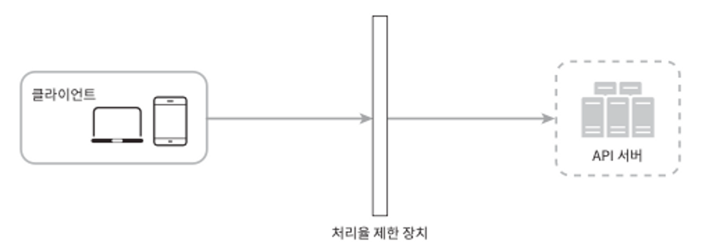
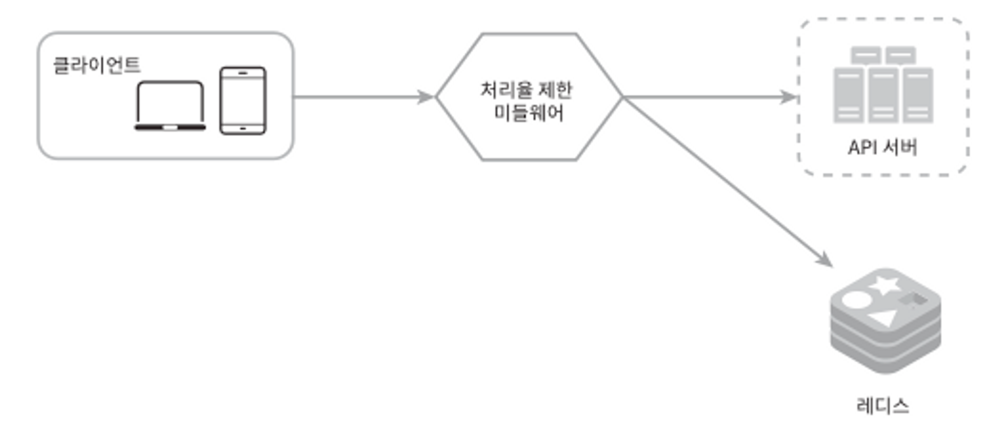
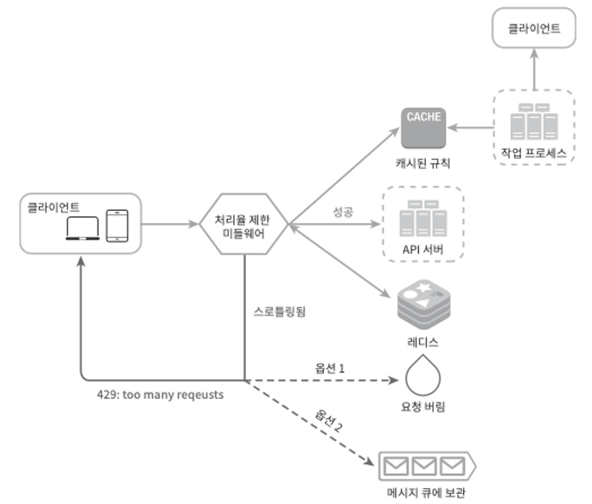
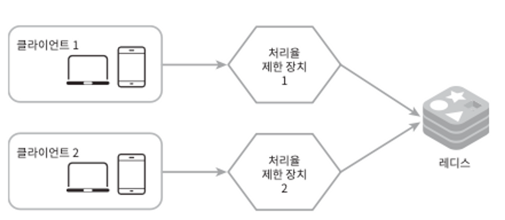

### 들어가기 전

처리율 제한 장치(rate limiter)란 클라이언트 또는 서비스가 보내는 트래픽의 처리율을 제어하기 위한 장치이다.

API에 처리율 제한 장치를 두면 좋은 점

- DoS(Denial of Service) 공격에 의한 자원 고갈(resource startvation)을 방지할 수 있다.
  처리율 제한 장치는 추가 요청에 대해서는 처리를 중단함으로써 DoS 공격을 방지한다
- 비용을 절감한다. 제 3자(third-party) API에 사용료를 지불하고 있는 회사들에게는 더욱 중요하다.
- 서버 과부하를 막는다. 봇에서 오는 트래픽이나 사용자의 잘못된 이용 패턴으로 유발된 트래픽을 걸러낸느데 처리율 제한 장치를 활용할 수 있다.

### 1단계 문제 이해 및 설계 범위 확정

요구사항

- 설정된 처리율을 초과하는 요청은 정확하게 제한한다.
- 낮은 응답시간: 이 처리율 제한 장치는 HTTP 응답시간에 나쁜 영향을 주어서는 곤란하다.
- 가능한 적은 메모리를 써야한다.
- 분산형 처리율 제한(distributed rate limiting): 하나의 처리율 제한 장치를 여러 서버나 프로세스에서 공유할 수 있어야 한다.
- 예외 처리: 요청이 제한되었을 때는 그 사실을 사용자에게 분명하게 보여주어야 한다.
- 높은 결함 감내성(fault tolerance): 제한 장치에 장애가 생기더라도 전체 시스템에 영향을 주어서는 안 된다.

### 2단계 개략적 설계얀 제시 및 동의 구하기

**처리율 제한 장치는 어디에 둘 것인가?**

- 클라이언트 측 : 일반적으로 클라이언트는 처리율 제한을 안정적으로 걸 수 있는 장소가 못 된다… 클라이언트 요청은 쉽게 위변조가 가능해서이다.
- 서버 측에 둔다면 방법이 2가지 있다.

  

  

    - MSA같은 경우는 보통 API 게이트웨이라 불리는 컴포넌트에 구현된다. API 게이트웨이는 처리율 제한, SSL 종단, 사용자 인증, IP 허용 목록 관리 등을 지원하는 완전 위탁관리형 서비스이다.
      일단은 API 게이트웨이가 처리율 제한을 지원하는 미들웨어라는 점만 기억하도록 하자.

어디에 두는 것은 정답이 없다. 기술 스택이나 인력, 우선순위, 목표에 따라 달라질 수 있다. 다만 일반적으로 적용될 수 있는 몇 가지 지침은 다음과 같다.

- 프로그래밍 언어, 캐시 서비스 등 현재 사용하고 있는 기술 스택을 점검하라. 현재 사용하는 프로그래밍 언어가 서버 측 구현을 지원하기 충분할 정도로 효율이 높은지 확인하라.
- 사업 필요에 맞는 처리율 제한 알고리즘을 찾아라. 서버 측에서 모든 것을 구현하기로 했다면, 알고리즘은 자유롭게 선택할 수 있다.
- 설계가 마이크로서비스에 기반하고 있고, 사용자 인증이나 IP 허용목록 관리 등을 처리하기 위해 API 게이트웨이를 이미 설계에 포함시켰다면 처리율 제한 기능 또한 게이트웨이에 포함시켜야 할 수도 있다.
- 처리율 제한 서비스를 직접 만드는 데는 시간이 들기 때문에 인력이 없다면 상용 API 게이트웨이를 쓰는 것이 바람직한 방법이다.

**처리율 제한 알고리즘**

설명은 이하 생략한다. 다 적어놓은 블로그가 있다…! 나중에 장단점을 확인해 필요한 알고리즘을 간단히 서칭할 수 있도록 장단점만 다루겠다.

[https://velog.io/@shinmj1207/처리율-제한-장치의-설계#처리율-제한-알고리즘](https://velog.io/@shinmj1207/%EC%B2%98%EB%A6%AC%EC%9C%A8-%EC%A0%9C%ED%95%9C-%EC%9E%A5%EC%B9%98%EC%9D%98-%EC%84%A4%EA%B3%84#%EC%B2%98%EB%A6%AC%EC%9C%A8-%EC%A0%9C%ED%95%9C-%EC%95%8C%EA%B3%A0%EB%A6%AC%EC%A6%98)

- 토큰 버킷(token bucket)
    - 장점
        - 구현이 쉽고 메모리 사용 측면에서도 효율적이다.
        - 짧은 시간에 집중된느 트래픽도 처리 가능하다. 버킷에 남은 토큰이 있기만 하면 요청은 시스템에 전달될 것이다.
    - 단점
        - 이 알고리즘은 버킷 크기와 토큰 공급률이라는 두 개 인자를 가지고 있는데, 이 값을 적절하게 튜닝하는 것은 까다로운 일이 될 것이다.
          → 근데 설계하면서 무조건적으로 해결해야할 일이라고 생각함
- 누출 버킷 알고리즘(leaky bucket)
    - 장점
        - 큐의 크기가 제한되어 있어 메모리 사용량 측면에서 효율적이다.
        - 고정된 처리율을 갖고 있기 떄문에 안정적 출력이 필요한 경우에 적합하다.
    - 단점
        - 단시간에 많은 트래픽이 몰리는 경우 큐에는 오래된 요청들이 쌓이게 되고, 그 요청들을 제때 처리 못하면 최신 요청들은 버려지게 된다.
        - 두 개 인자를 갖고 있는데, 이들을 올바르게 튜닝하기가 까다로울 수 있다.
- 고정 윈도 카운터 알고리즘(fixed window counter)
    - 장점
        - 메모리 효율이 좋고 이해하기 쉽다.
        - 윈도가 닫히는 시점에 카운터를 초기화하는 방식은 특정한 트래픽 패턴을 처리하기에 적합하다.
    - 단점
        - 윈도 경계 부근에서 일시적으로 많은 트래픽이 몰려드는 경우, 기대했던 시스템의 처리 한도보다 많은 양의 요청을 처리하게 된다.
- 이동 윈도 로깅 알고리즘
    - 장점
        - 이 알고리즘이 구현하는 처리율 제한 메커니즘은 아주 정교하다. 어느 순간의 윈도를 보더라도, 허용되는 요청의 개수는 시스템의 처리율 한도를 넘지 않는다.
    - 단점
        - 이 알고리즘은 다량의 메모리를 사용하는데, 거부된 요청의 타임스탬프도 보관하기 때문이다.
- 이동 윈도 카운터 알고리즘(sliding window counter)
    - 장점
        - 이전 시간대의 평균 처리율에 따라 현재 윈도의 상태를 계산하므로 짧은 시간에 몰리는 트래픽에도 잘 대응한다.
        - 메모리 효율이 좋다.
    - 단점
        - 직전 시간대에 도착한 요청이 균등하게 분포되어 있다고 가정한 상태에서 추정치를 계산하기 때문에 다소 느슨하다.
          → 심각한 것은 아니다. 40억 개의 요청 가운데 에러가 난 확률은 0.003%밖에 되지 않았음

**개략적인 아키텍처**



위 알고리즘의 기본 아이디어는 단순하다. 그렇다면 알고리즘에 사용한 카운터? 로그?는 어디에 보관할것인가…. 보통 메모리상에서 동작하는 캐시가 바람직한데, 빠른데다 시간에 기반한 만료 정책을 지원하기 때문이다. 일례로 레디스는 처리율 제한 장치를 구현할 때 자주 사용되는 메모리 기반 저장장치이다.

### 3단계 상세 설계

**처리율 제한 규칙**

리프트(Lyft)는 처리율 제한에 오픈 소스를 사용하고 있다면서 어떤 규칙이 사용되는지 예시를 준다…

근데 이게 끝이다…

```
domain: messaging descriptors:
	- key: message_type
		Value: marketing
		rate_limit:
			unit: day
			requests_per_unit: 5
```

책에서 나와있는 규칙은 다음과 같다…

1. 마케팅 메시지의 최대치를 하루 5개로 제한한다
2. 클라이언트가 분당 5회 이상 로그인할 수 없다

이러한 규칙들은 보통 설정 파일 형태로 디스크에 저장된다…

**처리율 한도 초과 트래픽 처리**

보통 API는 HTTP 429 응답을 클라이언트에게 보냄. 이떻게? 이렇게.

- 처리율 제한 장치가 사용하는 HTTP 헤더
    - X-Ratelimit-Remaining: 윈도 내에 남은 처리 가능 요청의 수.
    - X-Ratelimit-Limit: 매 윈도마다 클라이언트가 전송할 수 있는 요청의 수.
    - X-Ratelimit-Retry-After: 한도 제한에 걸리지 않으려면 몇 초 뒤에 요청을 다시 보내야 하는지 알림.

사용자가 너무 많은 요청을 보내면 429 too many requests 오류를 X-Ratelim-it-Retry-After 헤더와 함께 반환하도록 함.

**상세 설계**



**분산 환경에서의 처리율 제한 장치의 구현**

단일 서버를 지원하는 처리율 제한 장치를 구현하는 것은 어렵지 않다. 하지만 여러 대의 서버와 병렬 스레드를 지원하도록 시스템을 확장하는 것은 다음 두 가지 어려운 문제를 풀어야 한다.

- 경쟁 조건(race condition)
    - 이 문제를 해결하는 가장 널리 알려진 해결책은 락(lock)이다. 하지만 락은 시스템의 성능을 상당히 떨어뜨린다는 문제가 있다. 락 대신 쓸 수 있는 해결책 두 가지는 아래와 같다.
    - 루아 스크립트(Lua script) : https://engineering.classdojo.com/blog/2015/02/06/rolling-rate-limiter/
    - 정렬 집합(sorted set) : https://stripe.com/blog/rate-limiters
- 동기화(synchronization)
    - 처리율 제한 장치를 동기화하지 않으면 각기 다른 제한 장치에 대한 처리를 올바르게 수행할 수 없다.
    - 한 가지 해결책은 고정 세션(sticky session)을 활용하여 같은 클라이언트로부터 요청은 항상 같은 처리율 제한 장치로 보낼 수 잇도록 하는 것이다.

  


**성능 최적화**

지금까지 살펴본 설계는 두 가지 지점에서 개선이 가능하다.

1. 여러 데이터센터(IDC)를 지원하는 문제는 처리율 제한 장치에 매우 중요한 문제이다. 멀리 떨어진 사용자를 지원하려다 보면 지연시간이 증가할 수 밖에 없다.
2. 제한 장치 간에 데이터를 동기화할 때 최종 일관성 모델(eventual consistency model)을 사용하는 것이다. 모르겠으면 6장에 “데이터 일관성” 항목을 참고해라

**모니터링**

모니터링을 통해 확인하려는 것

- 채택된 처리율 제한 알고리즘이 효과적인가?
- 정의한 처리율 제한 규칙이 효과적인가?

꾸준한 모니터링을 통해 트래픽이 몰리는 시점이 발생하면 알고리즘을 바꾸는 것을 고려해야한다.

### 4단계 마무리

시간이 허락한다면 다음과 같은 부분을 언급해라.

- 경성(hard) 또는 연성(soft) 처리율 제한
    - 경성 처리율 제한: 요청의 개수는 임계치를 절대 넘어설 수 없다.
    - 연성 처리율 제한: 요청 개수는 잠시 동안은 임계치를 넘어설 수 있다.
- 다양한 계층에서의 처리율 제한
    - 이번 장에서는 애플리케이션 계층(HTTP: OSI 네트워크 계층도 기준으로 7번 계층)에서의 처리율 제한에 대해서만 살펴보았다. 하지만 다른 계층에서도 처리율 제한이 가능하다. 예를 들어, Iptables를 사용하면 IP 주소(IP는 OSI 기준으로 3번 계층)에 처리율 제한을 적용하는 것이 가능하다.
      참고로 OSI는 Open Systems Interconnection model의 약어로, 총 7개의 계층으로 구성된다.1번 계층은 물리(physical) 계층, 2번 계층은 데이터 링크(data link) 계층, 3번은 네트워크 계층, 4번은 전송(transport) 계층, 5번은 세션(session) 계층, 6번은 표현(presentation) 계층, 그리고 7번은 애플리케이션 계층이다.
- 처리율 제한을 회피하는 방법. 클라이언트를 어떻게 설계하는 것이 최선인가?
    - 클라이언트 측 캐시를 사용하여 API 호출 횟수를 줄인다.
    - 처리율 제한의 임계치를 이해하고, 짧은 시간 동안 너무 많은 메시지를 보내지 않도록 한다.
    - 예외나 에러를 처리하는 코드를 도입하여 클라이언트가 예외적 상황으로부터 우아하게(gracefully) 복구될 수 있도록 한다.
    - 재시도(retry) 로직을 구현할 때는 충분한 백오프(back-off) 시간을 둔다.
