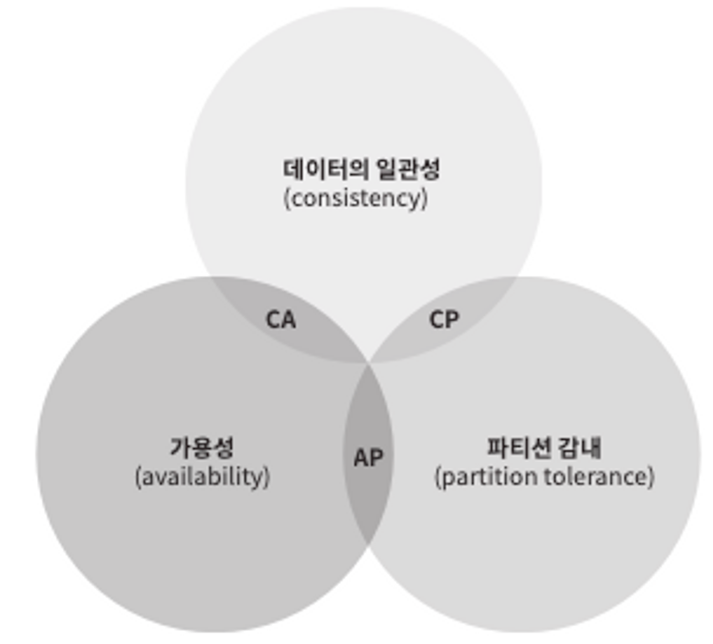
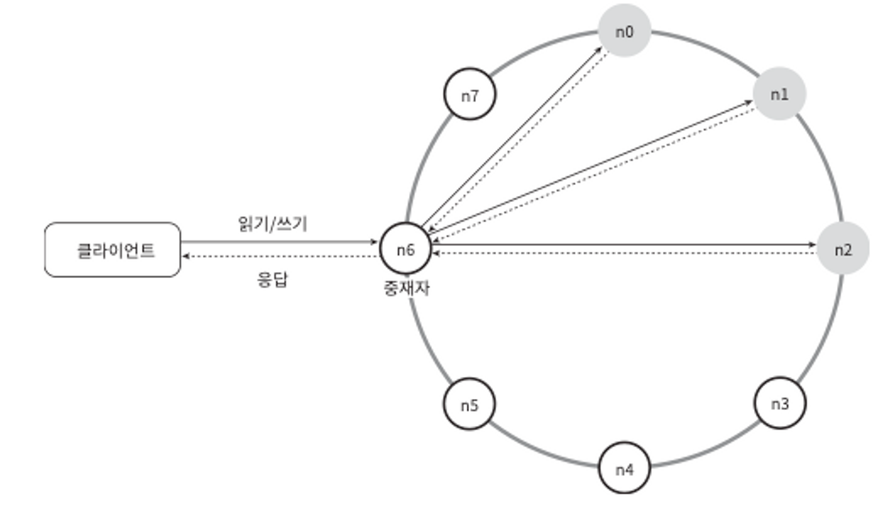
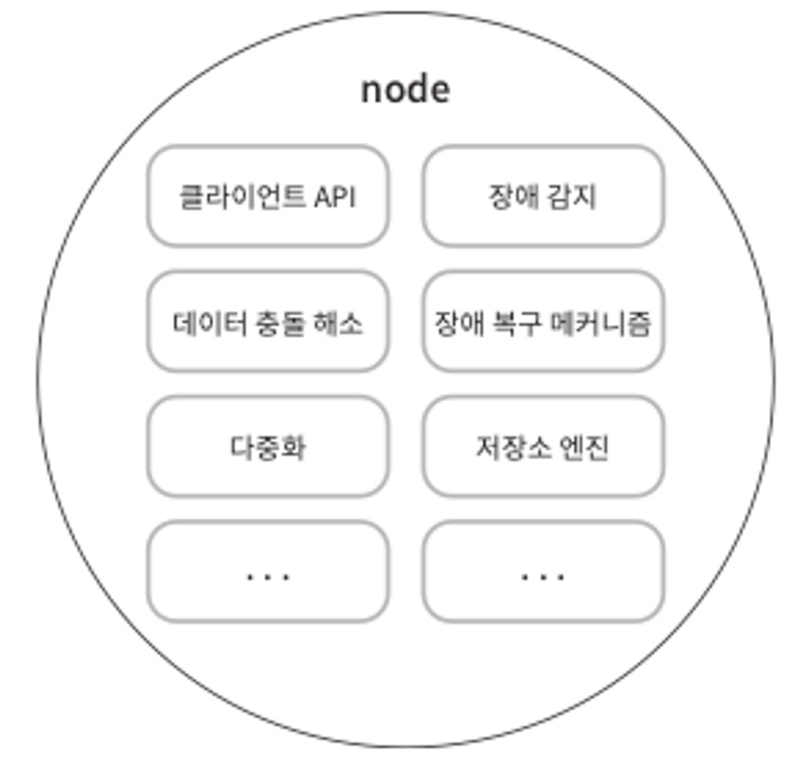
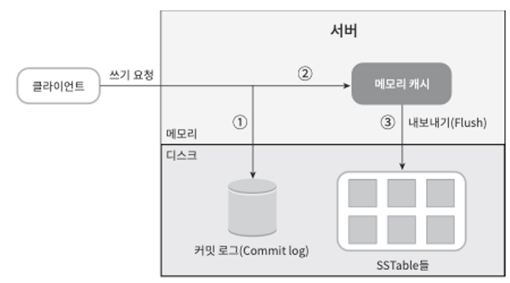
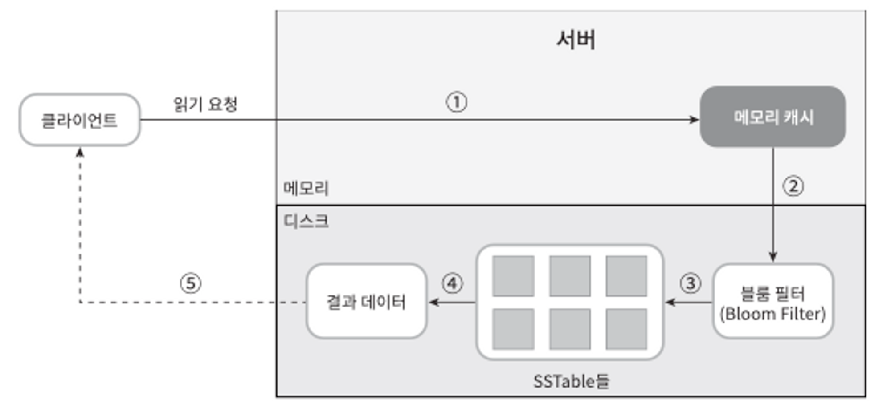
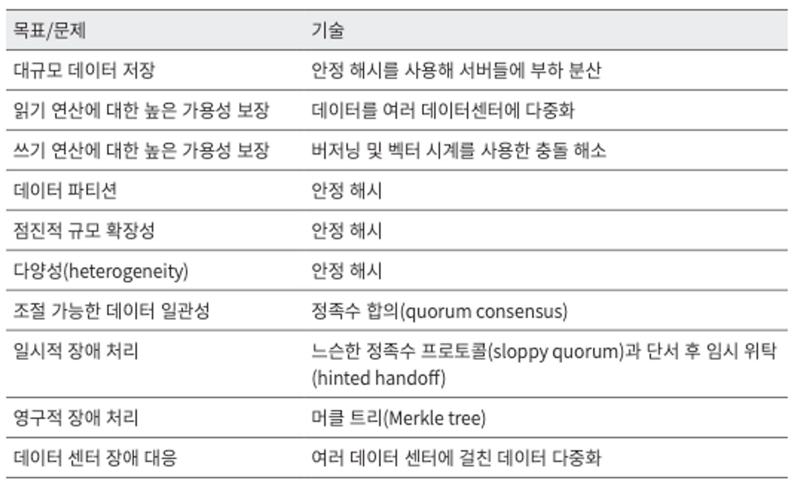

절—대 내가 키-값 저장소 설계할 일이 없을것같지만… 알아두면 좋은 알고리즘?들이 많이 나온듯 싶다

특히 장애 감지 부분이 좋았던것같음

[https://ko.wikipedia.org/wiki/블룸_필터](https://ko.wikipedia.org/wiki/%EB%B8%94%EB%A3%B8_%ED%95%84%ED%84%B0)

https://nicewoong.github.io/development/2018/02/11/cassandra-internal/

https://devureak.tistory.com/38

[https://velog.io/@emplam27/자료구조-그림으로-알아보는-B-Tree](https://velog.io/@emplam27/%EC%9E%90%EB%A3%8C%EA%B5%AC%EC%A1%B0-%EA%B7%B8%EB%A6%BC%EC%9C%BC%EB%A1%9C-%EC%95%8C%EC%95%84%EB%B3%B4%EB%8A%94-B-Tree)

### 문제 이해 및 설계 범위 확정

- 키-값 쌍의 크기는 10KB 이하이다.
- 큰 데이터를 저장할 수 있어야 한다.
- 높은 가용성을 제공해야 한다. 따라서 시스템은 설사 장애가 있더라도 빨리 응답해야 한다.
- 높은 규모 확장성을 제공해야 한다. 따라서 트래픽 양에 따라 자동적으로 서버 증설/삭제가 이루어져야 한다.
- 데이터 일관성 수준은 조정이 가능해야 한다.
- 응답 지연시간(latency)이 짧아야 한다.

### 단일 서버 키-값 저장소

한 대 서버만 사용하는 키-값 저장소를 설계하는 것은 쉬움ㅇㅇ 가작 직관적인 방법은 키-값 쌍 전부를 메모리에 해시 테이블로 저장하면 됨ㅇㅇ.

근데 이건 빠른 속도를 보장하긴 하지만 모든 데이터를 메모리 안에 두는 것이 불가능할 수도 있다는 약점을 갖고 있음. 이 문제를 해결하기 위한 개선책은 다음과 같은 것이 있음.

- 데이터 압축(compression)
- 자주 쓰이는 데이터만 메모리에 두고 나머지는 디스크에 저장

그러나 이렇게 개선한다고 해도, 한 대 서버로 부족한 때가 찾아올거임

### 분산 키-값 저장소

분산 키-값 저장소는 분산 해시 테이블이라고도 불림. 키-값 쌍을 여러 서버에 분산시키는 탓임… 분산 시스템을 설계할 때는 CAP 정리(Consistency, Availability, Partition Tolerance theorem)를 이해하고 있어야 함.

**CAP 정리**

일관성(consistency), 가용성(availability), 파티션 감내(partition tolerance)라는 세 가지 요구사항을 동시에 만족하는 분산 시스템을 설꼐하는 것은 불가능하다는 정리임… 어떤 두 가지를 충족하려면 나머지 하나는 반드시 희생되어야함.

일단 각 요구사항의 의미를 정리해보겠삼.

- 데이터 일관성: 분산 시스템에 접속하는 모든 클라이언트는 어떤 노드에 접속했느냐에 관계없이 언제나 같은 데이터를 봐야함.
- 가용성: 분산 시스템에 접속하는 클라이언트는 일부 노드에 장애가 발생하더라도 항상 응답을 받아야함.
- 파티션 감내: 파티션은 두 노드 사이에 통신 장애가 발생하였음을 의미. 파티션 감내는 네트워크에 파티션이 생기더라도 시스템은 계속 동작하여야 한다는 것을 뜻함.

- CP 시스템: 일관성과 파티션 감내를 지원하는 키-값 저장소. 가용성을 희생함.
- AP 시스템: 가용성과 파티션 감내를 지원하는 키-값 저장소. 데이터 일관성을 희생함.
- CA 시스템: 일관성과 가용성을 지원하는 키-값 저장소. 파티션 감내는 지원하지 않음. 그러나 통상 네트워크 장애는 피할 수 없는 일로 여겨지므로, 분산 시스템은 반드시 파티션 문제를 감내할 수 있도록 설계되어야 함. 그러므로 실세계에 CA 시스템은 존재하지 않음!

**시스템 컴포넌트**

이번 절에서는 키-값 저장소 구현에 사용될 핵심 컴포넌트들 및 기술들을 살펴볼 것이다.

- 데이터 파티션
- 데이터 다중화(replication)
- 일관성(consistency)
- 일관성 불일치 해소(inconsistency resolution)
- 장애 처리
- 시스템 아키텍처 다이어그램
- 쓰기 경로(write path)
- 읽기 경로(read path)

**데이터 파티션**

대규모 어플리케이션의 경우 전체 데이터를 한 대 서버에 욱여넣는 것은 불가능함. 데이터를 파티션 단위로 나눌 때는 다음 두 가지 문제를 중요하게 따져봐야 한다.

- 데이터를 여러 서버에 고르게 분산할 수 있는가?
- 노드가 추가되거나 삭제될 때 데이터의 이동을 최소화할 수 있는가?

이런 문제는 안정 해시로 풀면 매우 적합함. 안정 해시로 문제를 해결하면 이점ㅇ 있음

1. 규모 확장 자동화(automatic scaling): 시스템 부하에 따라 서버가 자동으로 추가되거나 삭제되도록 만들 수 있다.
2. 다양성(heterogeneity): 각 서버의 용량에 맞게 가상 노드(virtual node, 상세한 내용은 5장 참조)의 수를 조정할 수 있다. 다시 말해, 고성능 서버는 더 많은 가상 노드를 갖도록 설정할 수 있다.

**데이터 다중화**

높은 가용성과 안정성을 확보하기 위해서는 데이터를 N개 서버에 비동기적으로 다중화(replication)을 해야함.

노드가 한 서버만 가리키지 않도록 해야함. (내가 이해하기론 리전인듯)

**데이터 일관성**

정족수 합의(Quorum Consensus) 프로토콜을 사용하면 읽기/쓰기 연산 모두에 일관성을 보장할 수 있슴.

- N=사본 개수.
- W=쓰기 연산에 대한 정족수. 쓰기 연산이 성공한 것으로 간주되려면 적어도 W개의 서버로부터 쓰기 연산이 성공했다는 응답을 받아야 한다.
- R=읽기 연산에 대한 정족수. 읽기 연산이 성공한 것으로 간주되려면 적어도 R개의 서버로부터 응답을 받아야 한다

N, W, R 값을 어떻게 정할까…? 아래는 구성 제시임.

- R=1, W=N: 빠른 읽기 연산에 최적화된 시스템
- W=1, R=N: 빠른 쓰기 연산에 최적화된 시스템
- W+R>N: 강한 일관성이 보장됨 (보통 N=3, W=R=2)
- W+R≤N: 강한 일관성이 보장되지 않음

요구되는 일관성 수준에 따라 W, R, N의 값을 조정하면 된다.

- 일관성 모델
    - 강한 일관성(strong consistency): 모든 읽기 연산은 가장 최근에 갱신된 결과를 반환한다. 다시 말해서 클라이언트는 절대로 낡은(out-of-date) 데이터를 보지 못한다.
    - 약한 일관성(weak consistency): 읽기 연산은 가장 최근에 갱신된 결과를 반환하지 못할 수 있다.
    - 최종 일관성(eventual consistency): 약한 일관성의 한 형태로, 갱신 결과가 결국에는 모든 사본에 반영(즉, 동기화)되는 모델이다.
- 비 일관성 해소 기법:데이터 버저닝
    - 백터 시계
        - https://jonghoonpark.com/key-value-store-consistency
        - 단점
            1. 충돌 감지 및 해소 로직이 클라이언트에 들어가야해서 클라이언트 구현이 복잡해짐
            2. [서버:버전]의 순서쌍 개수가 굉장히 빨리 늘어남
               이 문제를 해결하려면 그 길에 어떤 임계치를 설정하고, 임계치 이상으로 길이가 길어지면 오래된 순서쌍을 벡터 시계에서 제거하도록 해야함. 그러나 이렇게 하면 버전 간 선후 관계가 정확하게 결정될 수 없기 때문에 충돌 해소 과정의 효율성이 낮아지게 된다. 하지만 다이나모 데이터베이스에 관계된 문헌에 따르면 아마존은 실제 서비스에서 그런 문제가 벌어지는 것을 발견한 적이 없다고 한다. 그러니 대부분의 기업에서 벡터 시계는 적용해도 괜 찮은 솔루션일 것이다.
- 장애 처리
    - 장애 감지 - 가십 프로토콜 (gossip protocol)
        - 동작원리
            - 각 노드는 멤버십 목록을 유지한다. 멤버십 목록은 `각 멤버 ID, 박동 카운터`쌍의 목록이다.
            - 각 노드는 주기적으로 자신의 박동카운터를 증가시킨다.
            - 각 노드는 무작위로 선정된 노드들에게 주기적으로 자기 박동 카운터 목록을 보낸다.
            - 박동 카운터 목록을 받은 노드는 멤버십 목록을 최신값으로 갱신한다.
            - 어떤 멤버의 박동 카운터 값이 지정된 시간동안 갱신되지 않으면 해당 멤버는 장애 상태인 것으로 간주된다. (아무 서버도 해당 서버에게서 리스트를 전달받지 못했다는 뜻)
    - 일시적 장애 처리
        - “단서 후 임시 위탁(hinted handoff)” 기법
    - 영구 장애 처리
        - 반-엔트로피(anti-entropy) 프로토콜: 사본을 동기화하는 프로토콜 => 사본들을 비교하여 최신 버전으로 갱신하는 과정을 포함한다.
        - 머클 트리 : 사본관의 일관성이 망가진 상태를 탐지하고 전송 데이터의 양을 줄이기 위함.

**시스템 아키텍처 다이어그램**

아키텍처의 주된 기능 서술

- 클라이언트는 키-값 저장소가 제공하는 두 가지 단순한 API, 즉 get(key) 및 put(key, value)와 통신한다.
- 중재자(coordinator)는 클라이언트에게 키-값 저장소에 대한 프락시(proxy) 역할을 하는 노드다.
- 노드는 안정 해시(consistent hash)의 해시 링(hash ring) 위에 분포한다.
- 노드를 자동으로 추가 또는 삭제할 수 있도록, 시스템은 완전히 분산된다(decentralized).
- 데이터는 여러 노드에 다중화된다.
- 모든 노드가 같은 책임을 지므로, SPOF(Single Point of Failure)는 존재하지 않는다.

완전히 분산된 설계를 채택하였으므로, 모든 노드는 그림에 제시된 모든 !!! 기능을 지원해야함!!

**쓰기 경로**

1. 쓰기 요청이 커밋 로그 파일에 기록
2. 데이터가 메모리 캐시에 기록
3. 메모리 캐시가 가득차거나 사전에 정의도니 어떤 임계치에 도달하면 데이터는 디스크에 있는 SSTable(<키, 값>의 순서쌍을 정렬된 리스트 형태로 관리하는 테이블)에 기록됨.

**읽기 경로**

데이터가 메모리 캐시에 있으면 캐싱된 데이터를 보내주지만 데이터가 메모리에 없는 경우에는 디스크에서 직접 가져와야함. 어느 SSTable에 찾는 키가 있는지 알아낼 효율적인 방법은 블룸 필터가 흔히 사용됨.

1. 데이터가 메모리 있는지 검사. 없으면 2로감
2. 데이터가 메모리에 없으면 블룸 필터를 검사
3. 블룸 필터를 통해 어떤 SSTable에 키가 보관되어 있는지 알아냄
4. SSTable에서 데이터 가져옴
5. 해당 데이터를 클라에게 반환

### 요약

