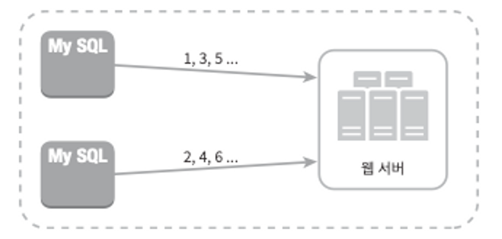
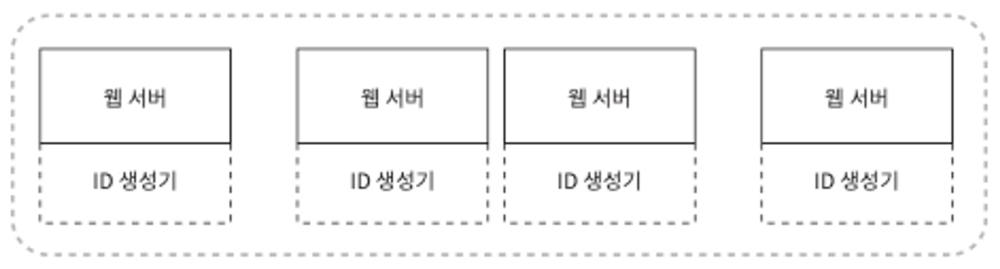
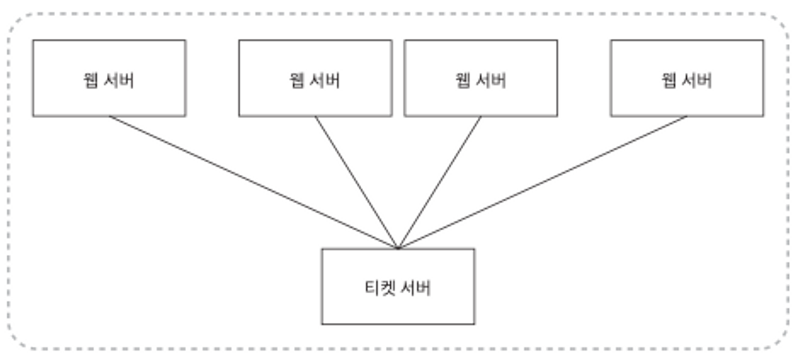
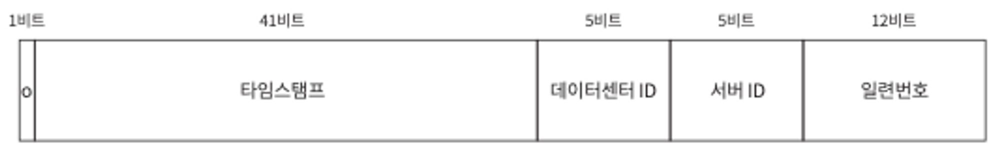
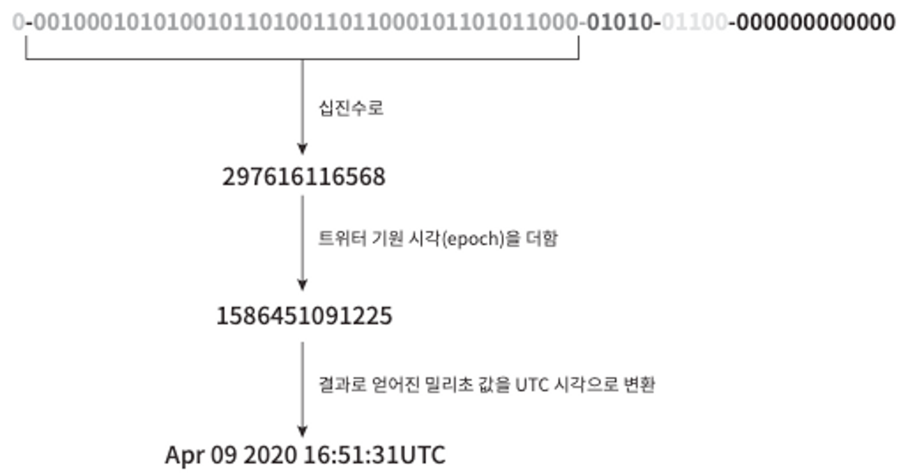

### 1단계 문제 이해 및 설계 범위 확정

- ID는 유일해야 한다
- ID는 숫자로만 구성되어야 한다
- ID는 64비트로 표현될 수 있는 값이어야 한다
- ID는 발급 날짜에 따라 정렬 가능해야 한다
- 초당 10,000개의 ID를 만들 수 있어야 한다

### 2단계 개략적 설계안 제시 및 동의 구하기

우리는 여러 가지 방법중에 다음과 같은 선택지를 살폅로거임 아마 많이 아는거임!

- 다중 마스터 복제(multi-master replication)
- UUID(Universally Unique Identifier)
- 티켓 서버(ticket server)
- 트위어 스노플레이크(twitter snowflake) 접근법

이제부터 장단점 살펴볼거임

**다중 마스터 복제**

이 접근법은 데이터베이스의 auto_increment 기능을 활용하는 것이다. 다만 다음 ID의 값을 구할 때 1만큼 증가시켜 얻는 것이 아니라, k(현재 사용중인 데이터베이스 서버의 수)만큼 증가시킨다.

하지만 중대한 단점이 있음

1. 여러 데이터 센터에 걸쳐 규모를 늘리기 어렵다
2. ID의 유일성은 보장되겠지만 그 값이 시간 흐름에 맞추어 커지도록 보장할 수는 없다
3. 서버를 추가하거나 삭제할 때도 잘 동작하도록 만들기 어렵다

**UUID**

UUID는 컴퓨터 시스템에 저장되는 정보를 유일하게 식별하기 위한 128비트짜리 수다. UUID 값은 충돌 가능성이 지극히 낮다. 위키피디아를 인용하면 “중복 UUID가 1개 생길 확률을 50%로 끌어 올리려면 초당 10억 개의 UUID를 100년동안 계속해서 만들어야 한다.

UUID는 서버 간 조율 없이 독립적으로 생성 가능하다

- 장점
    - UUID를 만드는 것은 단순함. 서버 사이의 조율이 필요 없으므로 동기화 이슈도 없음.
    - 각 서버가 자기가 쓸 ID를 알아서 만드는 구조이므로 규모 확장도 쉬움.
- 단점
    - ID가 128비트로 길다. 이번 장에서 다루는 문제의 요구사항은 64비트다.
    - ID를 시간순으로 정렬할 수 없다.
    - ID에 숫자(numeric) 아닌 값이 포함될 수 있다.

**티켓 서버**

이 아이디어의 핵심은 auto_increment 기능을 갖춘 데이터베이스 서버, 즉 티 켓 서버를 중앙 집중형으로 하나만 사용하는 것.

- 장점
    - 유일성이 보장되는 오직 숫자로만 구성된 ID를 쉽게 만들 수 있음.
    - 구현하기 쉽고, 중소 규모 애플리케이션에 적합.
- 단점
    - 티켓 서버가 SPOF(Signle-Point-of-Failure)가 됨.

**트위터 스노플레이크 접근법**

우리가 생성할 64비트 ID 구조는 다음과 같다.

- 사인(sign) 비트: 1비트를 할당한다. 지금으로서는 쓰임새가 없지만 나중을 위해 유보해 둠.
- 타임스탬프(timestamp): 41비트를 할당한다. 기원 시각(epoch) 이후로 몇 밀리초(millisecond)가 경과했는지를 나타내는 값.
- 데이터센터 ID: 5비트를 할당한다. 따라서 2 =32개 데이터센터를 지원할 수 있음.
- 서버 ID: 5비트를 할당한다. 따라서 데이터센터당 32개 서버를 사용할 수 있음.
- 일련번호: 12비트를 할당. 각 서버에서는 ID를 생성할 때마다 이 일련 번호를 1만큼 증가. 이 값은 1밀리초가 경과할 때마다 0으로 초기화 (reset)됨.

### 3단계 상세 설계

**타임스탬프**

타임스탬프는 앞서 살펴본 ID 구조에서 가장 중요한 41비트를 차지하고 있음. 타임스탬프는 시간이 흐름에 따라 점점 큰 값을 갖게 되므로, 결국 ID는 시간 순으로 정렬 가능하게 될 것.

41비트로 표현할 수 있는 타임스탬프의 최댓값은 대략 69년에 해당함. 따라서 이 생성기는 69년동안만 정상 동작하는데, 69년이 지나면 기원 시각을 바꾸거나 ID체계를 다른 것으로 이전하여야 함.

**일련번호**

일련번호는 12비트이므로, 2 =4096개의 값을 가질 수 있다. 어떤 서버가 같은 밀리초 동안 하나 이상의 ID를 만들어 낸 경우에만 0보다 큰 값을 갖게 된다.

### 4단계 마무리

추가 논의할 수 있는 것

- 시계 동기화(clock synchronization): 이 책에서 다루진 않지만, 그런 문제가 있다는 점을 알아두는 것은 중요하다. [NTP(Network Time Protocol)](https://en.wikipedia.org/wiki/Network_Time_Protocol)은 이 문제를 해결하는 가장 보편적 수단임
- 각 절(section)의 길이 최적화: 예를 들어 동시성(concurrency)이 낮고 수명이 긴 애플리케이션이라면 일련번호 절의 길이를 줄이고 타임스탬프 절의 길이를 늘리는 것이 효과적일 수도 있을 것
