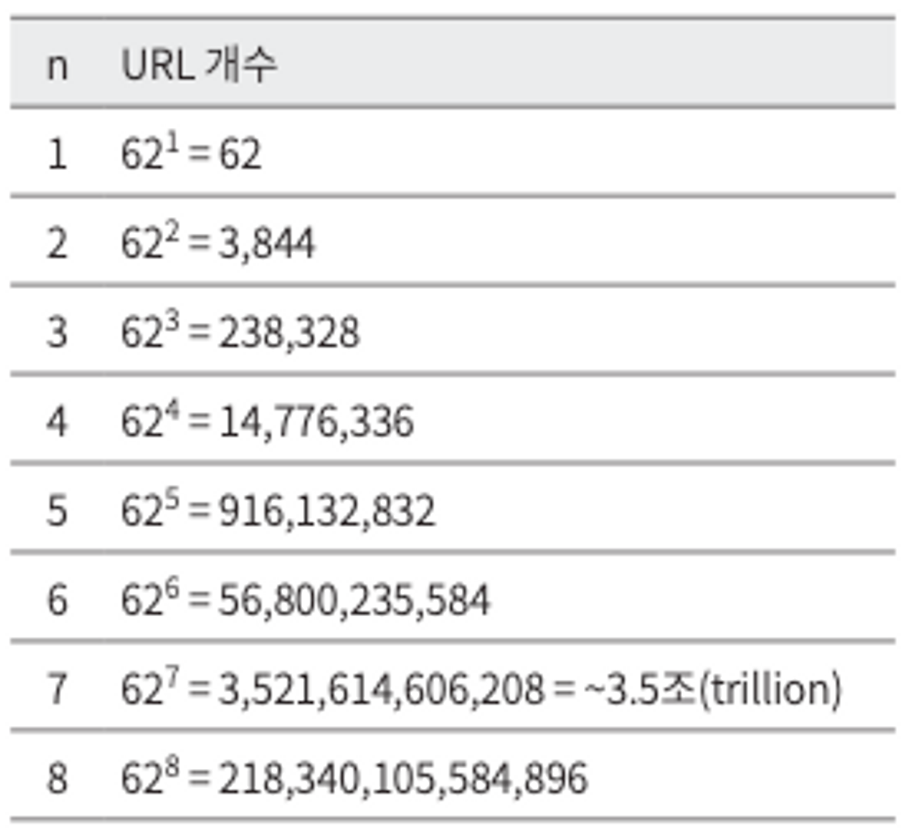
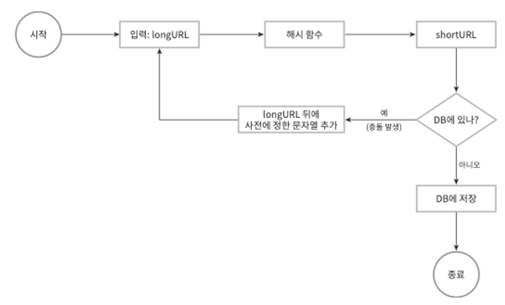
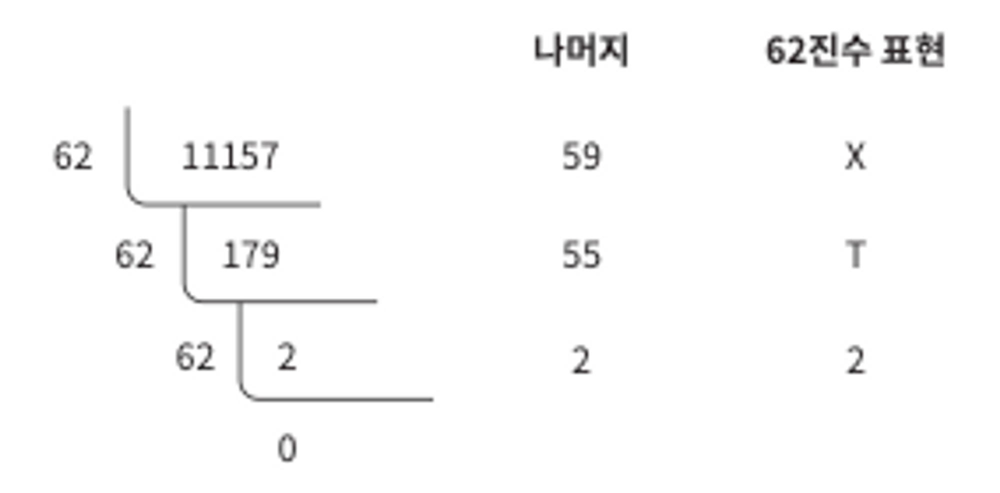
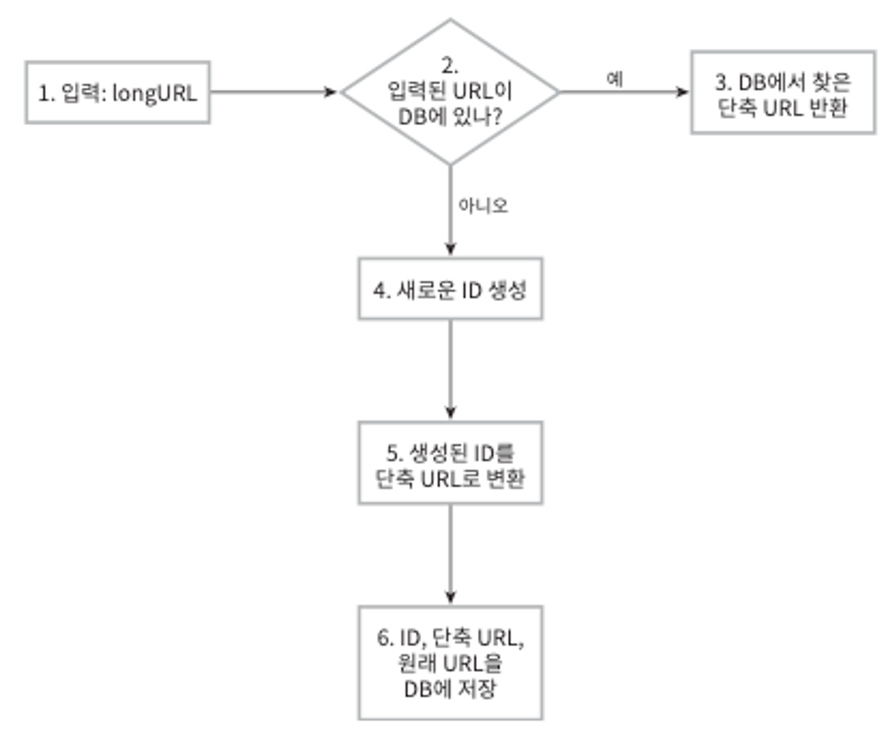

### 1단계 문제 이해 및 설계 범위 확정

질문 사항

- 예제를 보여줄 수 있는가?
- 트래픽 규모는 어느정도인가?
- 길이는 어느 정도여야하나?
- 문자에 제한이 있는가?
- 지우거나 갱신이 가능한가?

1. URL 단축: 주어진 긴 URL을 훨씬 짧게 줄인다
2. URL 리디렉션(redirection): 축약된 URL로 HTTP 요청이 오면 원래 URL로 안내
3. 높은 가용성과 규모 확장성, 그리고 장애 감내가 요구됨

**개략적 추정**

- 쓰기 연산: 매일 1억 개의 단축 URL 생성
- 초당 쓰기 연산: 1억 / 24 / 3600 = 1160
- 읽기 연산: 읽기 연산과 쓰기 연산 비율은 10:1이라고 하자… 그 경우 읽기 연산은 초당 11,600회 발생한다
- 10=3650억(365billion) 개의 레코드를 보관해야 한다.
- 축약 전 URL의 평균 길이는 100이라고 하자.
- 따라서 10년 동안 필요한 저장 용량은 3650억(365billion)×100바이트=36.5TB이다.

계산이 끝나면 결과를 면접관과 합의한 후에 진행하도록 하자…

### 2단계 개략적 설계안 제시 및 동의 구하기

**URL 리디렉션**

- 301 Permanently Moved
    - HTTP 요청의 처리 책임이 영구적으로 Location 헤더에 반환된 URL로 이전되었다는 응답. 영구적으로 이전되었기 때문에 브라우저는 이 응답을 캐시함.
    - 장점: 서버 부하를 줄여줌
- 302 Found
    - 주어진 URL로의 요청이 ‘일시적으로’ Location 헤더가 지정하는 URL에 의해 처리되어야 한다는 응답. 따라서 언제나 단축 URL 서버에 먼저 보내진 후에 원래 URL로 리디렉션 되어야함.
    - 장점: 트래픽 분석(클릭 발생률, 발생 위치 추적 등등)

### 3단계 상세 설계

**데이터 모델**

메모리는 유한한 데다 비싸기 때문에 <단축 URL, 원래 URL> 순서쌍을 관계형 데이터베이스에 저장할 거임.

일단 컬럼은 id, shortURL, longURL 정도가 좋겠다.

**해시 함수**

- 해시 값 길이
    - hashValue는 [0-9, a-z, A-Z]의 문자들로 구성됨.
    - n=7면 3.5조 개의 URL을 만들 수 있으므로 요구사항을 만족시키기 충분한 값. 따라서 길이는 7로하겠음.

      

    - 해시 함수 구현에 쓰일 기술은 ‘해시 후 충돌 해소’와 ‘base-62 변환’법임.
- 해시 후 충돌 해소

  

    - 해시 함수들 중에는 CRC32, MD5, SHA-1 등이 있음.
    - CRC32로 변환한게 8자리로 제일 짧지만 7보다 길음.
    - 해결 방법은 처음 7개만 사용하는 거임. 하지만 이렇게하면 충돌 가능성이 높아짐.
    - 충돌이 일어나면 충돌이 해소될 때 까지 사전에 정한 문자열을 해시값에 덧붙여서 해결한다.
    - 단점으로는 URL을 생성할 때 한 번 이상 데이터베이스 쿼리를 날려야하므로 오버헤드가큼.
    - db 대신 블룸 필터를 사용하면 성능을 높일 수 있음.
- base-62 변환

  

    - 진법 변환(base conversino)은 URL 단축기를 구현할 때 흔히 사용되는 접근법임.
    - 62진법을 쓰는 이유는 hashValue에 사용할 수 있는 문자 개수가 62개([0-9, a-z, A-Z])이기 때문
- 두 접근법 비교

| 해시 후 충돌 해소 전략                                          | base-62 변환                                                                 |
|--------------------------------------------------------|----------------------------------------------------------------------------|
| 단축 URL의 길이가 고정됨                                        | 단축 URL의 길이가 가변적. ID 값이 커지면 같이 길어짐                                          |
| 유일성이 보장되는 ID 생성기가 필요치 않음                               | 유일성 보장 ID 생성기가 필요                                                          |
| 충돌이 가능해서 해소 전략이 필요                                     | ID의 유일성이 보장된 후에야 적용 가능한 전략이라 충돌은 아예 불가능                                    |
| ID로부터 단축 URL을 계산하는 방식이 아니라서 다음에쓸 수 있는 URL을 알아내는 것이 불가능 | ID가 1씩 증가하는 값이라고 가정하면 다음에 쓸 수 있는 단축URL이 무엇인지 쉽게 알아낼 수 있어서 보안상 문제가 될 소지가 있음 |

**URL 단축기 상세 설계**

처리 흐름은 논리적으로 단순해야 하고 기능적으로는 언제나 동작하는 상태로 유지되어야함.

1. longURL 입력 받기
2. db에 URL 검사
3. 있으면 클라이언트에게 그대로 반환
4. 없으면 URL은 새로 접수된 것이므로 유일한 ID 생성해줌.
5. 디비에서 꺼낸 URL을 캐시에 넣은 후 사용자에게 반환함.

### 4단계 마무리

설계를 마친 후에 시간이 좀 남는다면 할 수 있는 이야기들…

- 처리율 제한 장치(rate limiter): 단축 요청이 밀려들 경우 무력화될 수 있다는 잠재적 보안 결함을 갖고 있으므로 처리율 제한 장치를 두면, IP 주소를 비롯한 필터링 규칙들을 이용해 요청을 걸러낼 수 있다. 4장을 다시 살펴보아랏.
- 웹 서버의 규모 확장: 본 설계에 포함된 웹 계층은 무상태 계층이므로, 웹 서버를 자유로이 증설하거나 삭제할 수 있음.
- 데이터베이스의 규모 확장: 데이터베이스를 다중화하거나 샤딩하여 규모 확장성을 달성할 수 있음.
- 데이터 분석 솔루션(analytics): 성공적인 비즈니스를 위해서는 데이터가 중요. 분석 도구가 될 수 있음.
- 가용성, 데이터 일관성, 안정성: 대규모 시스템이 성공적으로 운영되기 위해서는 반드시 갖추어야 할 속성.
