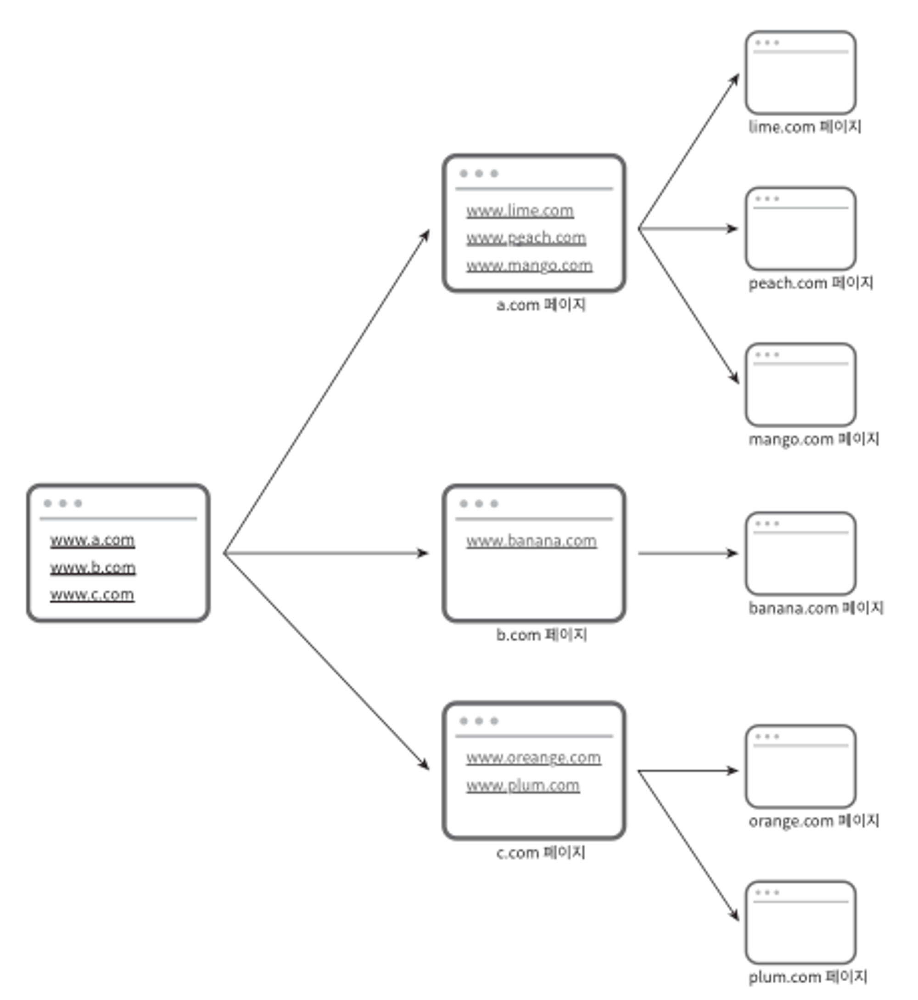
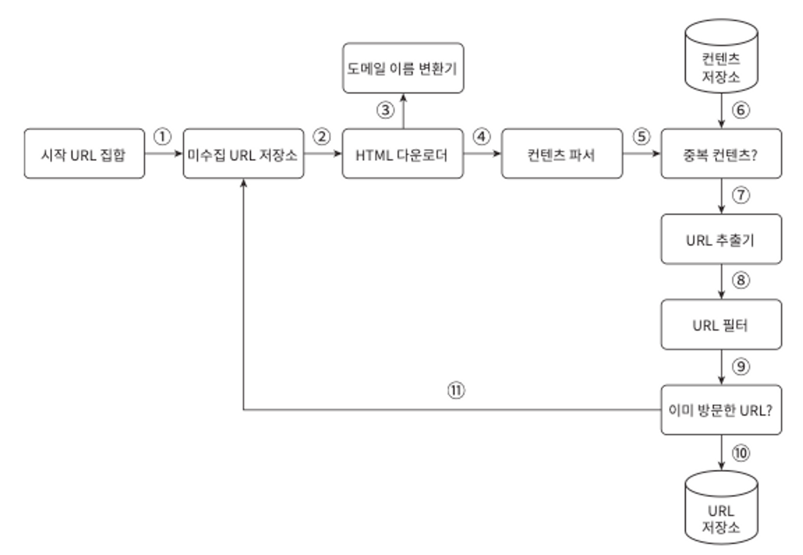
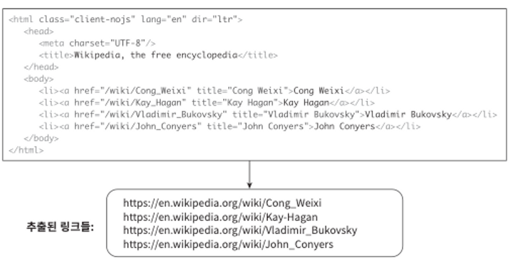
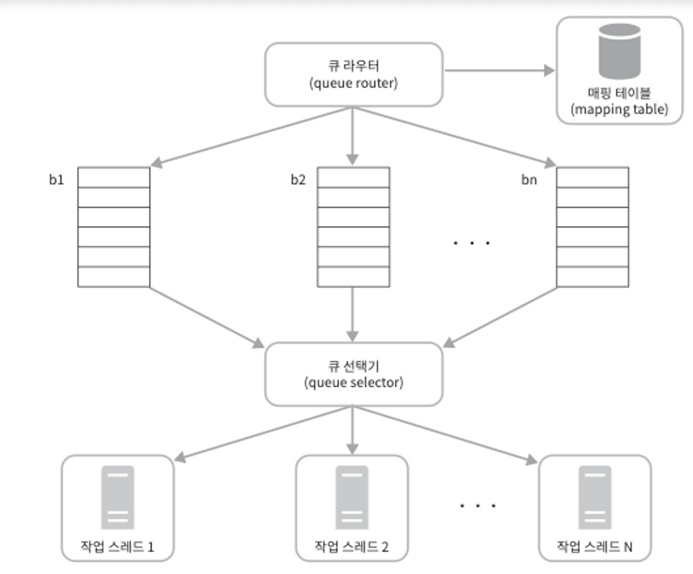
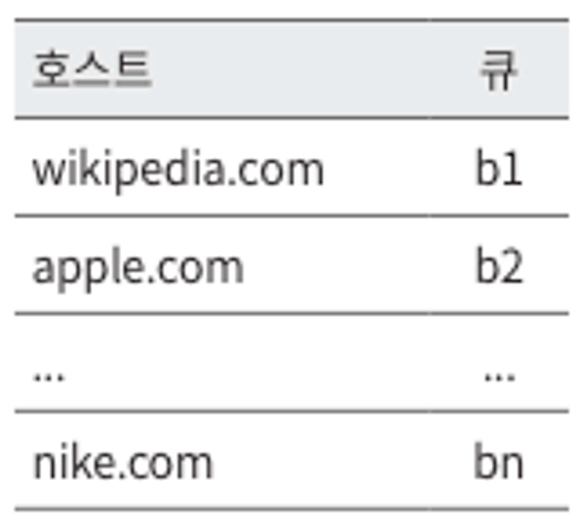
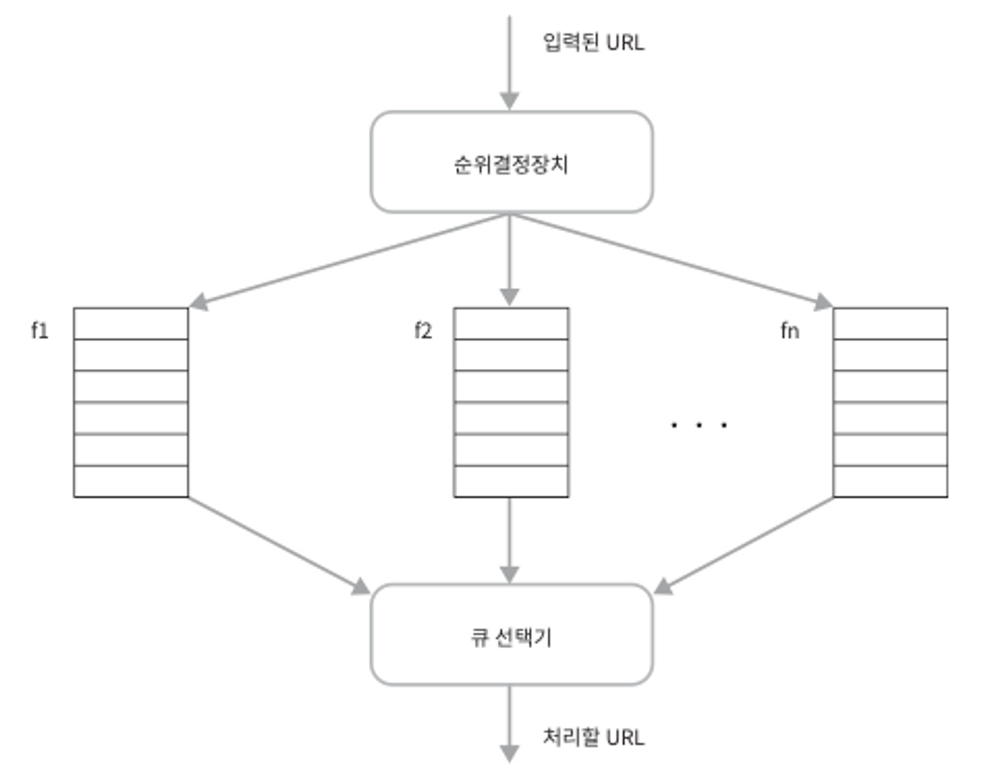
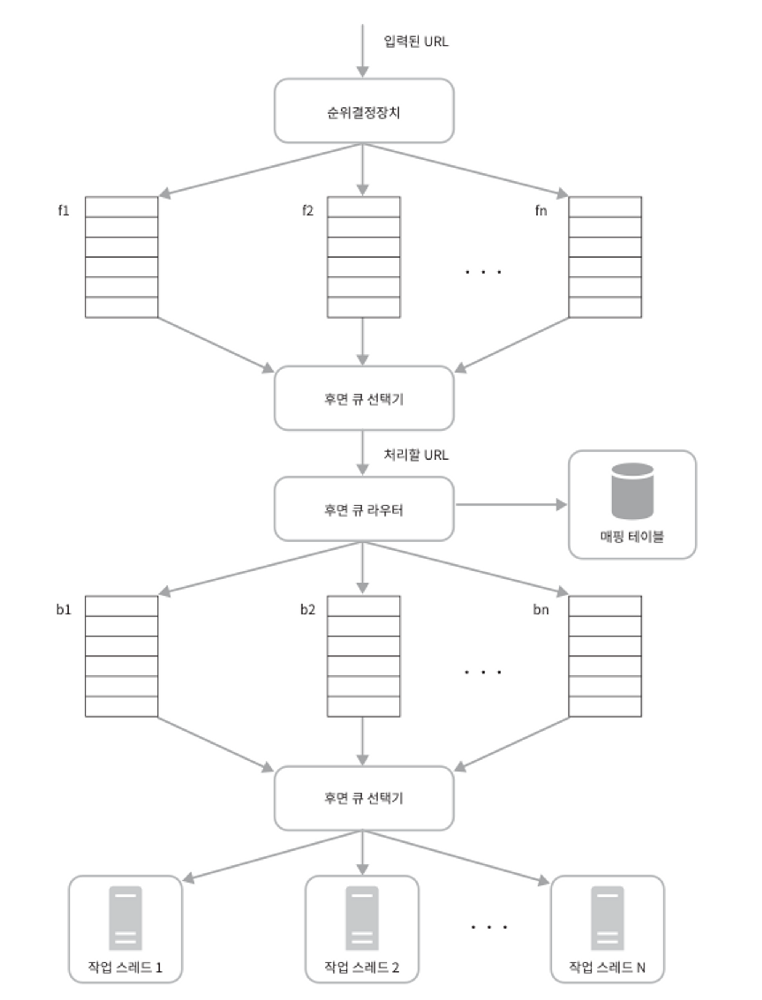
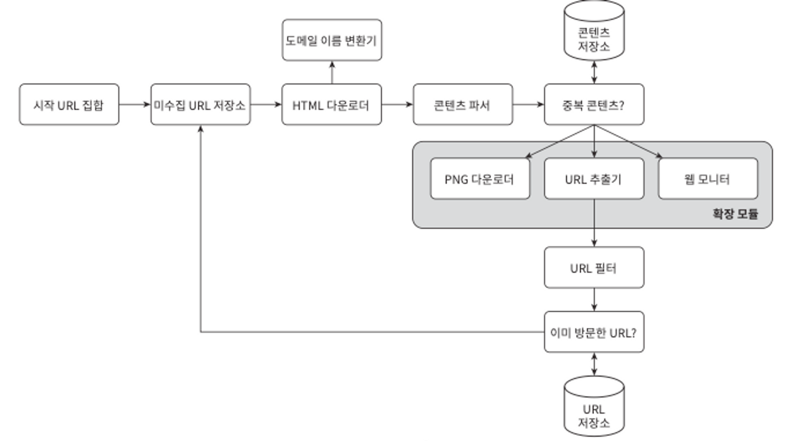

크롤러 활용

- 검색 엔진 인덱싱(search engine indexing): 크롤러의 가장 보편적은 용례. 크롤러는 웹 페이지를 모아 검색 엔진을 위한 로컬 인덱스(local index)를 만듦. 일례로 Googlebot은 구굴(Google) 검색 엔진이 사용하는 웹 크롤러임.
- 웹 아카이빙(web archiving): 나중에 사용할 목적으로 장기보관하기 위해 웹에서 정보를 모으는 절차를 말함. 많은 국립 도서관이 크롤러를 돌려 웹사이트를 아카이빙하고 있음. 대표적으로 미국 국회 도서관, EU 웹 아카이브가 있음.
- 웹 마이닝(web mining): 웹의 폭발적 성장세는 데이터 마이닝(data mining) 업계에 전례 없는 기회임. 웹 마이닝을 통해 인터넷에서 유용한 지식을 도출해낼 수 있음. 보고서등을 다운받아 기업의 핵심 사업 방향을 알아내기도 함.
- 웹 모니터링(web monitoring): 크롤러를 사용하면 인터넷이서 저작권이나 상표권이 침해되는 사례를 모니터링할 수 있음.

경우에 따라서 초대형 프로젝트가 될수도 있고, 학습 프로젝트가 될 수 있음.

### 1단계 문제 이해 및 설계 범위 확정

웹 크롤러의 기본 알고리즘은 간단함.

1. URL 집합이 입력으로 주어지면, 해당 URL들이 가리키는 모든 웹 페이지를 다운로드함.
2. 다운받은 웹 페이지에서 URL들을 추출
3. 추출된 URL들을 다운로드할 URL 목록에 추가하고 위의 과정을 처음부터 반복

하지만 단순하게 동작하지 않을거임. 질문을 통해 요구사항을 알아내고 설계 범위를 좁혀야함.
다음은 질문할 수 있는 몇 가지 사례임.

- 크롤러의 주된 용도는? (검색 엔진 인덱스 생성용, 데이터 마이닝 등등)
- 달마다 수집해야하는 페이지의 양
- 새로 만들어진 웹 페이지나 수정된 웹 페이지도 고려를 해야하는가?
- 저장 여부?
- 중복된 콘텐츠 처리?

면접관과 크롤러 기능 요구사항을 명확히 하는 한편, 좋은 웹 크롤러가 만족시켜야 할 다음과 같은 속성에 주의를 기울여야 함.

- 규모 확장성: 웹은 거대함.따라서 병행성을 활용하면 보다 효과적으로 크롤링 할 수 있음.
- 안정성(robustness): 웹은 잘못 작성된 html, 무반응 서버, 장애, 악성 코드가 붙어있는 것들 등의 함정이 가득함. 크롤러는 이런 비정상적 입력이나 환경에 잘 대응해야함.
- 예절(politeness): 크롤러는 수집 대상 웹 사이트에 짧은 시간 동안 너무 많은 요청을 보내서는 안 됨.
- 확장성(extensibility): 새로운 형태의 콘텐츠를 지원하기가 쉬워야 함.

**개략적 규모 추정**

- 매달 10억 개의 웹 페이지를 다운로드…
- QPS = 10억(1billion, 즉 1,000,000,000)/30일/24시간/3600초 = 대략 400페이지/초
- 최대(Peak) QPS = 2 x QPS = 800
- 웹 페이지의 크기 평균은 500k라고 가정
- 10억 페이지 x 500k - 500TB/월.
- 1개월 500TB x 12개월 x 5년 = 30PB

### 2단계 개략적 설계안 제시 및 동의 구하기

1. 시작 URL 집합
    - 시작 URL 집합은 웹 크롤러가 크롤링을 시작하는 출발점임.
    - 어떤 대학 웹사이트로부터 찾아 나갈 수 있는 모든 웹 페이지를 크롤링하는 가장 직관적인 방법은 해당 대학의 도메인 이름이 붙은 모든 페이지의 URL을 시작 URL로 쓰는 것.
    - 전체 웹을 크롤링해야 하는 경우는 시작 URL을 고를 때 좀 더 창의적일 필요가 있음. 크롤러가 가능한 많은 링크를 탐색할 수 있도록 하는 URL을 고르는 것이 바람직 할 것.
    - 시작 URL로 무엇을 쓸 것이냐는 질문에 정답은 없음. 면접관도 완벽한 답안을 기대하는 것이 아니니 의도가 무엇인지만 정확히 전달.
2. 미수집 URL 저장소
    - 대부분의 현대적 웹 크롤러는 크롤링 상태를 (1) 다운로드할 URL, (2) 다운로드된 URL의 두 가지로 나눠 관리.
    - 이 중 ‘다운로드할 URL’을 저장 관리하는 컴포넌트를 미수집 URL 저장소라고 부름.
3. HTML 다운로더
    - HTML downloader는 인터넷에서 웹 페이지를 다운로드하는 컴포넌트임. 다운로드할 페이지의 URL은 미수집 URL 저장소가 제공.
4. 도메인 이름 변환기
    - 웹 페이지를 다운 받으려면 URL을 IP 주소로 변환하는 절차가 필요.
    - [www.wikipedia.org](http://www.wikipedia.org) → 198.35.26.96
5. 콘텐츠 파서
    - 웹 페이지를 다운받으면 파싱과 검증 절차를 걸쳐야함.
    - 크롤링 서버 안에 콘텐츠 파서를 구현하면 크롤링 과정이 느려지게 될 수 있으므로, 독립된 컴포넌트를 생성.
6. 중복 콘텐츠인가?
    - 29% 가량의 웹 페이지 콘텐츠는 중복임.
    - 이 문제를 해결하기 위한 자료 구조를 도입하여 데이터 중복을 줄이고 데이터 처리에 소요되는 시간을 줄임.
    - 위에 대한 효과적인 방법은 웹 페이지의 해시 값을 비교하는 것
7. 콘텐츠 저장소
    - HTML 문서를 보관하는 시스템.
    - 저장소를 구현하는 데 쓰일 기술을 고를 때는 저장할 데이터의 유형, 크기, 저장소 접근 빈도, 데이터의 유효 기간 등을 종합적으로 고려.
    - 본 설계안은 디스크와 메모리를 동시에 사용.
        - 데이터 양이 너무 많으므로 대부분의 콘텐츠는 디스크에 저장
        - 인기 있는 콘텐츠는 메모리에 두어 접근 지연시간을 줄일 것
8. URL 추출기
    - HTML 페이지를 파싱하여 링크들을 골라내는 역할을 함.

   

9. URL 필터
    - 특정한 콘텐츠 타입이나 파일 확장자를 갖는 URL, 접속 시 오류가 발생하는 URL, 접근 제외 목록에 포함된 URL 등을 크롤링 대상에서 배제하는 역할
10. 이미 방문한 URL?
    - 이미 방문한 URL이나 미수집 URL 저장소에 보관된 URL을 추적할 수 있도록 하는 자료 구조를 사용.
    - 해당 자료 구조로는 블룸 필터나 해시 테이블이 널리 쓰임.
11. URL 저장소
    - URL 저장소는 이미 방문한 URL을 보관하는 저장소

### 3단계 상세 설계

- DFS(Depth-First Search) vs BFS(Breath-First Search)
- 미수집 URL 저장소
- HTML 다운로더
- 안정성 확보 전략
- 확장성 확보 전략
- 문제 있는 콘텐츠 감지 및 회피 전략

**DFS를 쓸 것인가, BFS를 쓸 것인가**

[Depth-First Search vs. Breadth-First Search | Baeldung on Computer Science](https://www.baeldung.com/cs/dfs-vs-bfs)

웹 크롤러는 보통 BFS를 사용한다, BFS는 큐를 사용하는 알고리즘임. 이 큐의 한쪽으로는 탐색할 URL을 집어넣고, 다른 한쪽으로는 꺼내기만 함.

문제점

- 한 페이지에서 나오는 링크의 상당수는 같은 서버로 되돌아감. 대부분의 링크는 동일한 서버의 다른 페이지를 참조하는 링크인데 이 때 링크들을 병렬로 다운받게 처리한다면 서버에 과부하가 걸리게 될 것. 이런 크롤러는 보통 ‘예의 없는’ 크롤러로 간주함.
- 표준적 BFS 알고리즘은 URL 간에 우선순위를 두지 않음. 이 말은 곧 처리 순서에 있어 모든 페이지를 공평하게 대우한다는 뜻. 하지만 모든 페이지가 같은 수준의 품질, 중요성을 갖고있지 않기 때문에 페이지 순위, 사용자 트래픽의 양, 업데이트 빈도 등 여러 가지 척도에 비추어 처리 우선순위를 구별하는 것이 온당할 것.

**미수집 URL 저장소**

위 문제를 미수집 URL 저장소를 활용하면 좀 쉽게 해결할 수 있음. 잘 구현하면 ‘예의’를 갖춘 크롤러, URL 사이의 우선순위와 신선도를 구별하는 크롤러를 구현할 수 있음.

관련 논문도 다수 나와있는데, 관련 논문 가운데 중요한 것을 요약하면 다음과 같음.

http://infolab.stanford.edu/~olston/publications/crawling_survey.pdf

https://www.ics.uci.edu/~lopes/teaching/cs221W12/slides/Lecture05.pdf

- 예의

  

    - 큐 라우터 : 같은 호스트에 속한 URL은 언제나 같은 큐(b1, b2…)로 가도록 보장하는 역할.
    - 매핑 테이블 : 호스트 이름과 큐 사이의 관계를 보관하는 테이블

      

    - 큐 : 같은 호스트에 속한 URL은 언제나 같은 큐에 보관
    - 큐 선택기 : 큐 선택기는 큐들을 순회하면서 큐에서 URL을 꺼내서 해당 큐에서 나온 URL을 다운로드하도록 지정된 작업 스레드에 전달하는 역할.
    - 작업 스레드 : 작업 스레드는 전달된 URL을 다운로드하는 작업을 수행. 전달된 URL은 순차적으로 처리될 것이며, 작업들 사이에는 일정한 지연시간을 둘 수 있음.
- 우선 순위 : 유용성에 따라 URL 우선순위를 나눌 때는 페이지랭크, 트래픽 양, 갱신 빈도 등 다양한 척도를 사용할 수 있을 것.

  

    - 순위결정장치 : URL을 입력으로 받아 우선순위를 계산.
    - 큐 : 우선순위별로 큐가 하나씩 할당. 우선순위가 높으면 선택될 확률도 올라감.
    - 큐 선택기 : 임의 큐에서 처리할 URL을 꺼내는 역할. 순위가 높은 큐에서 더 자주 꺼내도록 프로그램되어잇음.
- 위 두개를 반영한 전체 설계

  

    - 전면 큐: 우선순위 결정 과정을 처리
    - 후면 큐: 크롤러가 예의 바르게 동작하도록 보증
- 신선도
    - 웹 페이지는 수시로 추가되고, 삭제되고, 변경됨. 데이터의 신선함을 유지하기 위해서는 이미 다운로드한 페이지라고 해도 주기적으로 재수집할 필요가 있음. 전략은 다음과 같은게 있음.
    - 웹 페이지의 변경 이력 활용
    - 우선순위를 활용하여, 중요한 페이지는 좀 더 자주 재수집
- 미수집 URL 저장소를 위한 지속성 저장장치
    - 대부분의 URL은 디스크에 두지만 IO비용을 줄이기 위해 메모리 버퍼에 큐를 둔다. 버퍼에 있는 데이터는 주기적으로 디스크에 기록할 것.

**HTML 다운로더**

- 성능 최적화
    1. 분산 크롤링
        - 성능을 높이기 위해 크롤링 작업을 여러 서버에 분산하는 방법
        - 각 서버는 여러 스레드를 돌려 다운로드 작업을 처리함.
    2. 도메인 이름 변환 결과 캐시
        - 도메인 이름 변환기는 크롤러 성능의 병목 중 하나인데, DNS 요청을 보내고 결과를 받는 작업의 동기적 특성 때문.
        - DNS 조회 결과로 얻어진 도메인 이름과 IP 주소 사이의 관계를 캐시에 보관해 놓고 크론 잡 등을 돌려 주기적으로 갱신하도록 해 놓으면 성능을 효과적으로 높일 수 있음.
    3. 지역성
        - 크롤링 서버가 크롤링 대상 서버와 지역적으로 가까우면 페이지 다운로드 시간은 줄어들 것.
        - 이 전략은 대부분의 컴포넌트에 적용 가능
    4. 짧은 타임아웃
        - 어떤 웹 서버는 응답이 느리거나 아예 응답하지 않음. 때문에 타임아웃을 짧게 설정해놓으면 좋음.
- 안정성
    - 안정 해시: 다운로더 서버들에 부하 분산할 때 적용 가능한 기술. (5장 ‘안정 해시 설계’ 참고)
    - 크롤링 상태 및 수집 데이터 저장: 장애가 발생한 경우에도 쉽게 복구할 수 있도록 크롤링 상태와 수집된 데이터를 지속적 저장장치에 기록해 두는 것이 바람직.
    - 예외 처리: 예외가 발생해도 전체 시스템이 중단되는 일 없이 그 작업을 우아하게 이어나갈 수 있어야 함.
      → 이게 그 미확인 에러를 잡아야 함! 이런건가..
    - 데이터 검증: 시스템 오류를 방지하기 위한 중요 수단 중 하나.
- 확장성
    - 이런 시스템을 설계할 때는 새로운 형태의 콘텐츠를 쉽게 지원할 수 있도록 신경 써야 함.

      

- 문제 있는 콘텐츠 감지 및 회피
    1. 중복 콘텐츠
        - 해시나 체크섬을 사용하면 중복 콘텐츠를 보다 쉽게 탐지할 수 있음.
    2. 거미 덫
        - 거미 덫(spider trap)은 크롤러를 무한 루프에 빠뜨리도록 설계한 웹 페이지.
        - [spidertrapexample.com/foo/bar/foo/bar/foo/bar/](http://spidertrapexample.com/foo/bar/foo/bar/foo/bar/)... → 이런 덫은 URL의 최대 길이를 제한하면 회피할 수 있음.
        - 다른 또 한가지 방법은 수작업으로 덫을 확인하고 찾아낸 후에 덫이 있는 사이트를 크롤러 탐색 대상에서 제외하거나 URL 필터 목록에 걸어두는 것.
        - (길이 제한이랑 무한루프, 타임아웃에 예외가 발생하면 자동으로 추가해주는 것이 좋을듯)

### 4단계 마무리

추가로 논의해보면 좋은 것.

- 서버 측 렌더링(server-side rendering): 이 문제는 페이지를 파싱하기 전에 서버 측 렌더링(동적 렌더링dynamic rendering이라고도 불린다)을 적용하면 해결할 수 있음. → https://developers.google.com/search/docs/crawling-indexing/javascript/dynamic-rendering?hl=ko
- 원치 않는 페이지 필터링: 스팸 방지(anti-spam) 컴포넌트를 두어 품질이 조악하거나 스팸성인 페이지를 걸러내도록 해 두면 좋음.
- 데이터베이스 다중화 및 샤딩
- 수평적 규모 확장성(horizontal scalabilitiy): 수평적 규모 확장성을 달성하는 데 중요한 것은 서버가 상태 정보를 유지하지 않도록 하는 것, 즉 무상태 서버로 만들어야함.
- 가용성, 일관성, 안정성
- 데이터 분석 솔루션(analytics)
